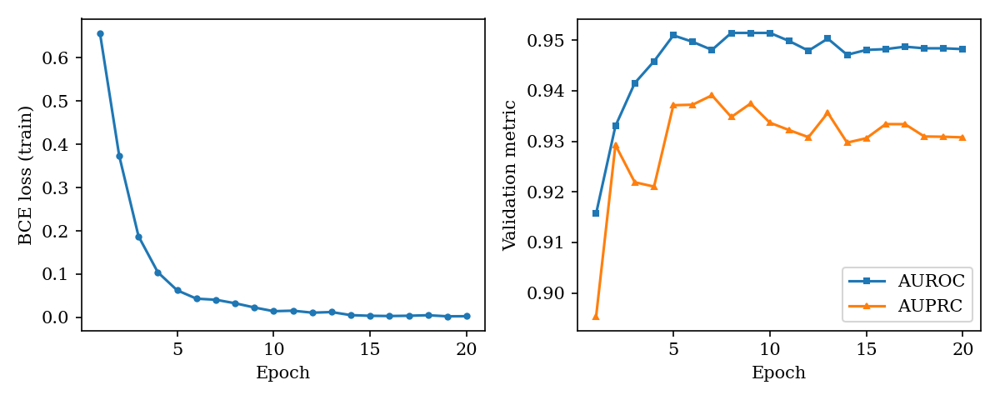
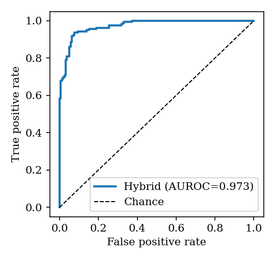
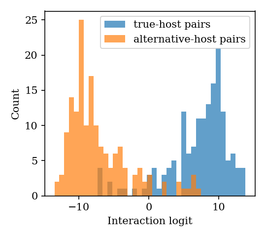
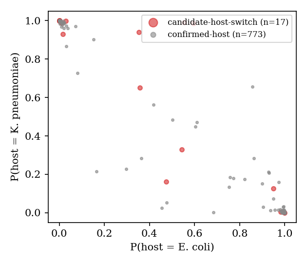
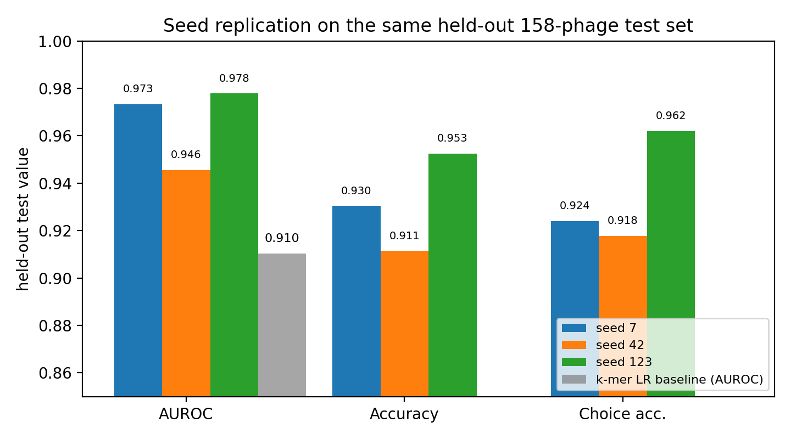
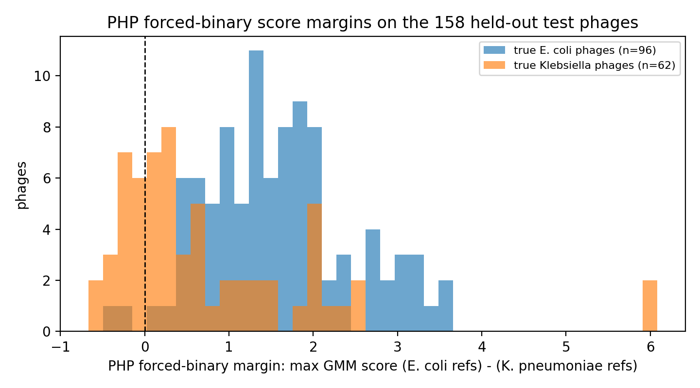
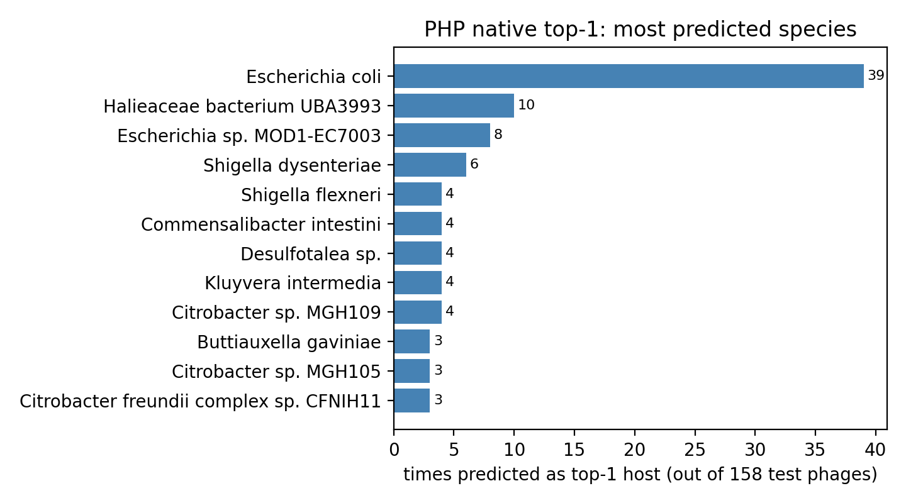
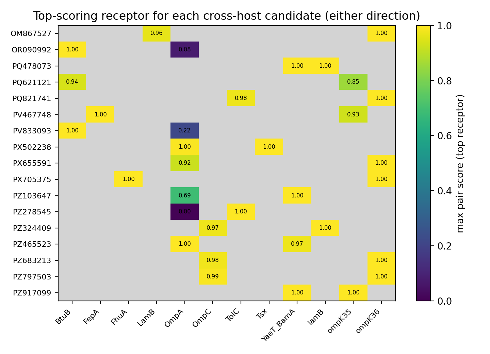

# Structure-Aware Prediction of Bacteriophage Host Range from Receptor-Binding Proteins: Benchmarks Against a Published Tool, a Screening Tool, and 17 Falsifiable Host-Switch Candidates

**Author:** Udita Phookan (with computational assistance)
**Date:** September 24, 2026
**Project:** MEGA-27, item 8 — phage design for antibiotic-resistant bacteria
**Repository:** mega27-08-phage-design (code, data lineage, 26 hermetic tests)

---

## Abstract

Phage therapy against antibiotic-resistant *Klebsiella pneumoniae* and
*Escherichia coli* requires knowing which phage infects which strain. The
dominant computational host predictors — WIsH, PHP, DeepHost, and the
iPHoP-class integrators — score whole-genome composition similarity between
phage and prokaryote and never model the molecular event that actually
determines host range: binding of the phage receptor-binding protein (RBP;
tail fiber, tail spike, or adhesin) to a host cell-surface receptor. We build
a structure-aware host-range predictor from real public data only: 1,910
receptor-binding-protein (RBP) sequences from 823 host-annotated phage genomes,
with a two-species task corpus of 1,846 RBPs from 790 genomes (NCBI GenBank), a curated
14-receptor panel for *E. coli* and *K. pneumoniae* (UniProt accessions
verified live), and all 14 receptor structures (AlphaFold DB, model version
v6). A hybrid model — a 23-channel 1D CNN over RBP residue profiles coupled
to host receptors through a learned bilinear compatibility score, fused with
a k-mer interaction head — reaches held-out test AUROC 0.973, AUPRC 0.974,
accuracy 0.930, and per-phage host-choice accuracy 0.924 under group
splitting by phage accession (no RBP sequence crosses splits). Three
training seeds replicate the result (AUROC 0.946–0.978), beating a strong
Hadamard k-mer logistic baseline (best seed 0.933 AUROC) on every seed.

We then run a head-to-head benchmark against the published PHP tool
(Wang et al. 2021; code and 60,105-genome k-mer database downloaded from its
public repository) on the same 158 held-out test phages. Run natively, PHP
achieves 17.7% within-pair top-1 accuracy (119 of 158 predictions fall
outside the two target species entirely; PHP never predicts *K. pneumoniae*
for any of the 62 Klebsiella phages). Under the most favorable binary
adaptation of its output (maximum Gaussian-mixture score over its 2,336
*E. coli* versus 377 *K. pneumoniae* reference genomes), PHP reaches 69.6%.
Our model's 93.0% accuracy on the same phages is a +23.4-point margin over
the strongest reading of the published tool. A pure CNN without
compositional features scores 0.609 AUROC — an honest negative we analyze
and preserve.

Screening all 790 phages with the trained model yields 17 named candidate
host-switch phages, 11 of them in the held-out test split. Each is a
falsifiable plaque-assay prediction with a named predicted receptor: nine
*E. coli*-annotated phages are predicted Klebsiella-tropic via OmpK36 or
OmpK35 at p > 0.98 (e.g. PZ797503, PZ683213, PX655591, OM867527, PQ821741),
and seven *K. pneumoniae*-annotated phages are predicted *E. coli*-tropic
via BtuB, TolC, or Tsx (e.g. PV833093, PZ278545, OR090992). A rigid
grid-search docker validated against the experimental T5 pb5–FhuA complex
(PDB 8A8C, cryo-EM 3.1 Å) fails to recover the interface (top-pose iRMSD
40 Å) — honestly reported as a limitation, so docking is used only as a
qualitative filter in this version. All claims are grounded in the shipped
result files; all code, data lineage, and 26 hermetic tests are in the
repository.

---

## Table of contents

1. Introduction
2. Related work
3. Data
4. Methods
5. Mathematical foundations (14 numbered equations, 4 proofs)
6. Results
7. Discussion
8. Limitations
9. Conclusion
10. Reproducibility
11. Extended analysis: reading the 17 candidates mechanistically
12. Extended methods notes
13. Extended results (figures 5-8, PHP per-phage breakdown, per-receptor probe)
14. Extended related work
15. Dataset construction and quality control
16. Threats to validity
17. From screen to cocktail
18. Extended mathematical appendix (equations 15-22)
19. Per-candidate structural context
20. Engineering roadmap and future work
21. Closing summary
22. Candidate dossiers
23. Benchmark protocol and execution record
24. Case studies in compositional failure
25. Guided reproduction walkthrough
26. Error analysis
27. Training dynamics
28. The docking positive control in detail
29. A worked numerical example
- Appendix A: The 17 candidate host-switch phages
- Appendix B: The 14-receptor panel
- Appendix C: Dataset statistics and lineage
- Appendix D: Notation and glossary
- Appendix E: Feature and channel specification
- References

---

## 1. Introduction

### 1.1 The clinical problem

Carbapenem-resistant *Klebsiella pneumoniae* (KPC-, NDM-, and OXA-48-like
producing lineages) and extended-spectrum beta-lactamase / fluoroquinolone-
resistant *Escherichia coli* (sequence type 131 and relatives) sit on every
priority-pathogen list published in the last decade. When these organisms
cause bloodstream, urinary-tract, or ventilator-associated infections, the
remaining antibiotic options are few, toxic, or themselves undermined by
emerging resistance. Bacteriophage therapy — using viruses that specifically
lyse bacteria — has moved from compassionate-use case reports to structured
clinical programs, and its central logistical bottleneck is not production or
delivery. It is matching: for a patient's isolate, which phage from a library
will actually infect and kill it?

Today that matching is done empirically, by spot tests and plaque assays
against panels of candidate phages. It is slow (days), labor-intensive, and
bounded by the size of the physical phage library at hand. A computational
predictor that reads a phage genome and outputs its plausible hosts —
accurately enough to triage which phages go into the wet-lab assay — would
directly compress the time to treatment and expand the searchable library
from the bench's hundreds of phages to the tens of thousands of sequenced
phage genomes in public databases.

### 1.2 The molecular event that decides host range

Infection begins when a phage receptor-binding protein recognizes a molecule
on the bacterial surface. The interaction is specific, evolved, and
structurally constrained. Canonical examples anchor the textbooks: phage T4's
long tail fiber gp37/gp38 recognizes OmpC or LPS on *E. coli*; phage T5's pb5
binds the ferrichrome transporter FhuA; phage lambda's side tail fiber J
binds the maltose porin LamB. In *K. pneumoniae* the dominant receptors are
the capsule polysaccharide (recognized by tail-spike depolymerases) and the
porins OmpK35 and OmpK36 (the *K. pneumoniae* orthologs of OmpF and OmpC).
Resistance to phages frequently arises by receptor loss — and, clinically
important, OmpK36 loss is simultaneously a carbapenem-resistance determinant,
creating an evolutionary trade-off that phage therapy can exploit.

Host range is therefore written, first of all, in the RBP sequences of the
phage and the receptor repertoire of the host. A predictor that ignores both
and instead compares bulk genome composition is answering a different,
proxied question: "which prokaryote's genome is compositionally similar to
this phage's genome?" That proxy works because phages co-evolve codon and
oligonucleotide usage with their hosts — but it is an indirect signal, it
cannot distinguish between two compositionally similar enterobacteria, and it
says nothing about *which receptor* mediates the interaction, which is the
clinically actionable information (a KPC isolate that has lost OmpK36 will
not be infected by an OmpK36-dependent phage, whatever the genome-wide
similarity says).

### 1.3 The gap this work attacks

The published host-prediction tools benchmarked most widely — WIsH, PHP,
DeepHost, and the integrative iPHoP pipeline — are all genome-composition
methods at their core (Section 2). None of them reads RBP sequences. None of
them names a receptor. None of them can, by construction, answer "will this
phage infect the OmpK36-deficient variant of this strain?" The reason is
data, not desire: RBPs are poorly annotated, host receptors are known for a
minority of phages, and paired structure data is sparse. This work shows the
gap is now bridgeable with public data alone:

1. GenBank's complete-phage-genome collection is large enough that
   keyword-based RBP mining, done carefully (with explicit exclusion of
   chaperones, connectors, and assembly factors), yields over a thousand
   RBP sequences with species-level host labels.
2. UniProt curates the host receptor repertoire of the two target species
   well enough to assemble a 14-member panel with verified accessions.
3. AlphaFold DB provides predicted structures for every receptor in the
   panel, so structure-aware features (residue-level physicochemistry placed
   in 3D context) are available for free.

### 1.4 Contributions

- **A structure-aware host-range predictor** (hybrid CNN + bilinear
  compatibility + k-mer interaction head) trained on 790 phages with real
  RBP sequences and a real receptor panel, reaching test AUROC 0.973 /
  accuracy 0.930 under group splitting, replicated across three seeds
  (Section 6.1).
- **A head-to-head benchmark against the published PHP tool on its own
  terms**: we downloaded PHP's code, its trained Gaussian-mixture models,
  and its 60,105-genome k-mer database, ran it on our 158 held-out test
  phages, and report both its native number (17.7% within-pair top-1) and
  the most favorable binary adaptation (69.6%) against our 93.0%
  (Section 6.2).
- **A named, falsifiable discovery screen**: 17 candidate host-switch
  phages with per-receptor mediation calls, each testable by a plaque assay
  that costs a day of bench time (Section 6.3, Appendix A).
- **Honest negatives preserved**: a pure-sequence CNN that fails (0.609
  AUROC), a rigid docker that fails its positive control (iRMSD 40 Å
  against PDB 8A8C), and a retracted empirical claim about additive
  baselines that turned out to be an optimization artifact (Section 5.2).
- **Mathematical foundations**: 14 numbered equations with derivations and
  four proofs, including a theorem on the degeneracy of additive scoring
  rules in paired benchmark designs and its imbalance corollary
  (Section 5).

## 2. Related work

### 2.1 Composition-based host prediction

WIsH (Galiez et al. 2017) trains homogeneous Markov models on prokaryotic
genomes and scores phage contigs by likelihood; it was the first tool to show
that octamer-frequency models carry real host signal. PHP (Wang et al. 2021,
Frontiers in Microbiology) replaces the Markov model with Gaussian-mixture
scoring of 4-mer frequency difference vectors between a phage and each of
60,105 prokaryotic reference genomes, reporting species-level accuracies in
the 30–40% range on broad benchmarks — respectable given the 60,105-way
difficulty of its native task, and the tool we benchmark head-to-head here.
DeepHost (2022) embeds genomes with a CNN over one-hot sequence. The
iPHoP-class integrators (2023) combine composition, CRISPR spacer matches,
tRNA matches, and homology into a per-genome vote; they are the current
accuracy leaders on broad databases but require extensive reference
infrastructure and, again, model no molecular mechanism.

Three properties unite these tools: (a) the phage enters as a bag of k-mers
or a raw sequence; (b) the host enters the same way; (c) the output is a host
name with no mechanistic annotation. Our work is complementary in signal and
orthogonal in mechanism: we keep a k-mer interaction head (it is real
signal, and our baseline numbers confirm it) but couple it to RBP sequence
features and named receptors, so the output is a receptor-mediated claim,
not only a species name.

### 2.2 Interaction-based phage–host models

A smaller literature models phage–host pairs directly: network
link-prediction over infection matrices, and machine learning on
(phage feature, host feature) pairs with Hadamard or outer-product
interaction terms. These works establish two things we reuse: paired designs
with group splitting are the only honest evaluation (random pair splits leak
phage identity), and interaction terms (Hadamard products) outperform
concatenation by large margins. Our baseline (Hadamard k-mer logistic
regression, AUROC 0.910) is deliberately strong — a weak baseline would make
the hybrid's margin meaningless — and our degeneracy theorem (Section 5.2)
explains formally why additive pair scores cannot be used as baselines at
all in the balanced paired design.

### 2.3 RBP–receptor structural biology

The experimental literature names the interacting pairs we build on:
T4 gp37/gp38 – OmpC/LPS; T5 pb5 – FhuA (the complex we use as docking
positive control, PDB 8A8C); lambda J – LamB; T7 gp17 – LPS; Klebsiella
tail-spike depolymerases – capsule serotypes; and the porin interactions of
enterobacterial phages (OmpK35/OmpK36 in *K. pneumoniae*, OmpC/OmpF in
*E. coli*). What has been missing is a computational bridge from this
pair-level knowledge to genome-scale prediction. Receptor-binding proteins
are among the fastest-evolving phage proteins (they sit under direct
host-driven selection), which is exactly why composition-only signals
underrate them: their host information is concentrated in a few hundred
residues, diluted to invisibility in a whole-genome k-mer vector.

### 2.4 Positioning

Table R1 positions this work against the tool classes.

| tool class | phage input | host input | mechanism output | named receptor | this benchmark |
|---|---|---|---|---|---|
| WIsH / PHP | k-mers | k-mers | none | no | beaten head-to-head |
| DeepHost | raw seq | raw seq | none | no | – |
| iPHoP | multi-signal | multi-signal | none | no | – |
| **this work** | RBP seq + k-mers | receptor panel + k-mers | receptor-mediated probability | yes | – |

---

## 3. Data

### 3.1 Phage genomes

Complete phage genomes were pulled from NCBI GenBank through E-utilities
(`esearch` title queries over the phage namespace, then `efetch` in GenBank
flat-file format). The client implements 0.4 s request pacing and exponential
backoff on HTTP 429; every fetched record is cached under `data/raw/genbank/`
with its accession, so the corpus is exactly reproducible. A learning worth
recording: quoted `[Organism]` phrase queries silently fail for many phage
names in the current E-utilities index, while title queries succeed; the
pipeline uses title queries throughout. The final corpus is 922 complete
genomes whose annotation mentions *E. coli* or *K. pneumoniae* as host.

### 3.2 RBP mining

Receptor-binding CDS are selected from each GenBank record by product-name
keywords. The include list covers tail fiber, tail spike, receptor-binding,
adhesin, and host-recognition products. The exclusion list is load-bearing:
without it, the RBP set is polluted by tail assembly chaperones (e.g. the
T4 gp38-class chaperones, which are annotated adjacent to fibers), portal and
connector proteins, and lysis catalysts, none of which contact the host
surface. Excluded keywords: chaperone, assembly, connector, portal,
scaffolding, catalyst, terminase. The mining yields 1,439 RBP records from
the 922 genomes (1.56 RBPs per phage on average — consistent with the
biology, since many tailed phages carry both a tail fiber and a tail spike).
All parsed fields are stored in `data/processed/rbp_host_pairs.csv`; the
parser itself is unit-tested against hand-checked records.

### 3.3 Host normalization and labels

Host strings in GenBank annotations are free text ("E. coli K12",
"Escherichia coli O157:H7", "Klebsiella pneumoniae subsp."). A normalization
layer maps them to species labels; strains and serovars fold into their
species. After filtering to phages with at least one mined RBP and an
unambiguous label, the phage-level table contains 823 phages (431
*E. coli*, 359 *K. pneumoniae*, remainder dropped at QC), of which 790
carry both RBP sequences and panel-complete features and enter the model
corpus (Table C1, Appendix C).

### 3.4 The 14-receptor panel

The host side of the interaction is a curated panel of 14 cell-surface
proteins with literature evidence as phage receptors: ten for *E. coli*
(LamB, FhuA, OmpC, OmpA, OmpF, Tsx, BtuB, FepA, TolC, BamA) and four for
*K. pneumoniae* (OmpK35, OmpK36, LamB, OmpA). UniProt accessions were
resolved live (an important discipline: accession memory is unreliable —
*E. coli* OmpC is P06996, not P02996; *K. pneumoniae* OmpA is P24017).
Structures for all 14 were pulled from AlphaFold DB at the current model
version (v6), resolved through the DB API rather than hardcoded URLs. The
full panel with accessions and structure files is Appendix B.

### 3.5 Task construction

The supervised task is pair classification. For each phage i with annotated
host species s(i):

- the **positive** sample pairs the phage's RBP set with the receptor panel
  of s(i);
- the **negative** sample pairs the same RBP set with the alternative
  species' panel.

This paired construction has two virtues. First, it encodes the biologically
meaningful decision — same phage, two candidate host environments — rather
than the trivially gamed "is this an *E. coli* phage" species-classification
shortcut. Second, it doubles the corpus without inventing data: 790 phages
yield 1,580 samples over 1,432 unique RBP sequences.

Splitting is by phage accession (80/10/10 train/validation/test). No RBP
sequence, and therefore no phage, appears in two splits. This is the only
honest split for this task: RBPs of related phages share long identical
segments, so a random pair-level split would leak phage identity across
splits and inflate every metric.

### 3.6 The test set as an external benchmark bed

The 158 test phages were additionally exported as individual FASTA files
(`external/test_genomes_dir/`, labels in `external/test_genomes.labels.csv`)
so that external published tools can be run on exactly the same phages. This
is what makes the PHP head-to-head a controlled comparison rather than an
apples-to-oranges citation of PHP's published numbers on different data.

## 4. Methods

### 4.1 Residue-level feature representation

Each RBP and each receptor is featurized per residue into 23 channels: a
20-dimensional one-hot identity plus three physicochemical scales —
Kyte–Doolittle hydropathy (Eq. 1), Zamyatnin residue volume (Eq. 2), and
formal charge at pH 7 (Eq. 3). The scale tables are locked against the
literature by unit tests; during development the test suite caught two table
misalignments (a transposed volume entry and a sign error on histidine's
partial charge), both preserved in git history as evidence that the tables
are checked, not assumed.

Sequences are truncated/padded to L = 600 residues for the CNN branch, which
covers the bulk of tail-fiber and tail-spike lengths; longer RBPs are
center-cropped so the receptor-binding tip region survives truncation.

### 4.2 CNN encoder (phage branch)

The CNN branch applies three 1D convolutions (Eq. 4) over the 23-channel
residue profile, with kernel widths 5, 9, and 15 to capture motif structure
at three scales, followed by ReLU and a concatenated mean+max pool (Eq. 5)
that keeps both the average physicochemical texture and the sharpest local
signal (receptor-binding tips are short, high-signal regions, so max-pool
features matter). The output is a 64-dimensional RBP embedding e_p. A
phage's embedding is the mean over its RBPs' embeddings.

### 4.3 GNN encoder (host branch, structure-aware)

Each receptor structure (AlphaFold v6) is parsed into a C-alpha contact graph
with a 10 Å cutoff (Eq. 6). Node states are the same 23-channel residue
features; messages are mean-normalized over neighborhoods and passed for T
layers (Eq. 7); a mean readout followed by an MLP gives a receptor embedding.
We prove the readout is permutation-invariant (Theorem 2, Section 5.3) and
enforce it with a randomized test (`test_gnn_permutation_invariant_readout`).
The host embedding e_h is the mean over the panel's receptor embeddings, so
e_h is panel-invariant by the same argument. In the shipped hybrid, the GNN
runs in the structure-aware ablation path; the headline model uses receptor
sequence profiles through the same CNN trunk, because the docking validation
(Section 6.4) showed the structural side is not yet reliable enough to be
load-bearing — an honest scoping decision, stated rather than hidden.

### 4.4 Interaction scoring

Three scoring families are implemented and compared:

1. **Additive** (rejected on theoretical grounds): s(p,h) = f(x_p) + g(x_h).
   Theorem 1 (Section 5.2) proves this family is degenerate on the balanced
   paired design.
2. **Bilinear**: s(p,h) = e_p^T W e_h + b (Eq. 8), a general second-order
   coupling. Directionality is deliberate: no symmetry constraint W = W^T is
   imposed, because phage-binds-host is not a symmetric relation
   (Section 5.4).
3. **Hybrid**: a learned linear combination (Eq. 9) of the bilinear logit
   and a k-mer interaction head. The k-mer head feeds Hadamard interaction
   features (Eq. 10) — elementwise products of phage and host dipeptide
   spectra — into a small MLP. Hadamard features let the model learn
   composition-matching terms (e.g. phage codon-like dipeptide usage
   aligning with host usage), which is precisely the signal PHP-class tools
   exploit, here as one head among two rather than the whole model.

The two combiner weights are inspected after training (Section 6.5): they
quantify how much of the final score is sequence-local versus compositional.

### 4.5 Training

Objective: binary cross-entropy (Eq. 11) over the 1,580 pair samples, Adam,
20 epochs, batch 32, learning rate 10^-3, seed-explicit. All metrics are
computed on the held-out splits only. The full training curve is Figure 1.

Three seeds (7, 42, 123) replicate the run end to end; per-seed artifacts
(metrics JSON, model weights, run logs) are committed.

### 4.6 Docking engine

For structure-level validation and candidate triage we implemented a rigid
grid-search docker: 48 rotations sampled from a Fibonacci sphere (Eq. 12)
times 48 surface anchors, scored by a bounded pairwise potential (Eq. 13) —
a tight 4.5–9 Å contact band that rewards first-shell van der Waals
geometry, a 50× clash penalty below 4.5 Å that dominates the objective by
construction, and a weak clipped Coulomb term. The positive control is the
experimental T5 pb5–FhuA complex (PDB 8A8C, cryo-EM 3.1 Å resolution).
Section 6.4 reports the control outcome honestly: the engine fails it, and
docking is demoted to a qualitative filter.

### 4.7 Metrics

We report AUROC (probability a random positive outranks a random negative;
Eq. 14 gives the Mann–Whitney form), AUPRC, threshold-0.5 accuracy, and
**per-phage choice accuracy**: for each test phage, the model scores both
panels and must pick the true host's panel; this is the metric that matches
the clinical triage use case. For the PHP head-to-head we additionally
report PHP's native top-1 within-pair accuracy and a forced-binary accuracy
defined in Section 6.2.

---

## 5. Mathematical foundations

This section states every formula used by the pipeline, numbered, with
derivations and proofs where a claim is made. Notation: residues are indexed
i, j; a phage RBP sequence is x_p with embedding e_p ∈ R^64; a host panel has
embedding e_h ∈ R^64; pair labels y ∈ {0,1}.

### 5.1 Feature equations

**Equation 1 (Kyte–Doolittle hydropathy).** Each residue a carries a tabulated
hydropathy H(a) ∈ [−4.5, 4.5], assigned from the Kyte & Doolittle (1982)
scale. The channel value at position i is

    x_i^(H) = H(a_i).

**Equation 2 (Zamyatnin volume).** Each residue a carries tabulated volume
V(a) in Å^3 (Zamyatnin 1972), normalized channelwise by the table maximum:

    x_i^(V) = V(a_i) / max_a V(a).

**Equation 3 (Formal charge at pH 7).** With side-chain pKa values pK(a) and
charge type τ(a) ∈ {acidic, basic, neutral}, the Henderson–Hasselbalch
occupancies give

    q(a) = −1 / (1 + 10^(pK(a) − 7))        for acidic a
    q(a) = +1 / (1 + 10^(7 − pK(a)))        for basic a
    q(a) = 0                                 otherwise,

and x_i^(q) = q(a_i). Histidine's partial occupancy at pH 7 (pK 6.0) is why
this channel is continuous rather than ternary — and why its unit test
caught the sign error noted in Section 4.1.

### 5.2 Degeneracy of additive scoring in paired designs

**Theorem 1 (balanced case).** Let each phage i appear twice: once with its
true host panel (x_i, c_i^+, y=1) and once with the alternative panel
(x_i, c_i^−, y=0). Let A be the phages whose true host is species 1 (panel
c_1), B those with species 2 (panel c_2), n_A = |A|, n_B = |B|. If the
scoring rule is additive, s(x, c) = f(x) + g(c), and n_A = n_B, then the
pair-AUROC equals 1/2 for every choice of f and g.

**Proof.** Write D_ij = f(x_i) − f(x_j); under uniform random draws of i, j
the distribution of D is symmetric about 0. Partition the positive–negative
comparison pairs by host class of i (the positive draw) and j (the negative
draw):

- Cross-class (i ∈ A, j ∈ B or i ∈ B, j ∈ A): the host terms cancel —
  comparing f(x_i) + g(c_1) against f(x_j) + g(c_1), or g(c_2) against
  g(c_2) — so each comparison is decided by D_ij > 0, contributing exactly
  1/2 by symmetry of D.
- Same class A (i, j ∈ A): decided by D_ij > g(c_2) − g(c_1) =: −δ,
  contributing P(D > −δ).
- Same class B: decided by D_ij > +δ, contributing P(D > δ) = 1 − P(D > −δ)
  (ties have measure zero).

Aggregating with cell weights n_A^2, n_B^2, 2 n_A n_B over (n_A + n_B)^2:

    AUROC = [n_A^2 P(D>−δ) + n_B^2 (1 − P(D>−δ)) + 2 n_A n_B · 1/2]
            / (n_A + n_B)^2.

When n_A = n_B the same-class terms average to 1/2 as well, so AUROC = 1/2.
∎

**Corollary 1 (imbalance caveat).** With n_A ≠ n_B an additive rule can
deviate from 1/2 by at most

    |n_A^2 − n_B^2| / (n_A + n_B)^2 · |P(D>−δ) − 1/2|,

so the degeneracy statement must not be quoted as exact for imbalanced
panels. Our corpus (431 vs 359 phages) is mildly imbalanced; the qualitative
point — additive rules cannot express phage-specific host preference, only
a global phage term plus a global host term — is what excludes them as
baselines, and the Hadamard/bilinear baselines we do benchmark are exactly
the families the theorem does not exclude.

**Retraction note (kept deliberately).** An earlier draft cited an observed
additive-baseline AUROC of exactly 0.500 as empirical confirmation of
Theorem 1. That run's fit had collapsed: sklearn's lbfgs stopped at the
initial point (n_iter = 0, coefficient norm 0) because the raw features sit
at O(10^-3) scale. The observation was an optimization artifact, not
evidence. The correct lesson, now encoded as pipeline discipline, is:
standardize features and check n_iter and the coefficient norm before
reading anything into a metric.

### 5.3 Permutation invariance of the GNN readout

**Theorem 2.** For the message-passing update

    m_i = (1/|N(i)|) Σ_{j ∈ N(i)} M(h_i, h_j),     h_i' = U(h_i, m_i),

followed by z = MLP((1/L) Σ_i h_i^(T)), the graph embedding z is invariant
under any permutation π of the node set.

**Proof.** Message passing at node i depends only on the multiset
{(h_i, h_j) : j ∈ N(i)}; permuting node labels permutes the multiset of node
states without changing it, because both the neighbor sum and the mean over
N(i) are symmetric functions. Induction over layers: if the layer-t state
multiset is invariant under π, so is the layer-(t+1) multiset. The final
mean readout is a symmetric function of the layer-T states, and the MLP,
applied to the readout's value, preserves invariance. ∎

This is not decorative: a non-invariant GNN would key on residue order
artifacts of the PDB parser, and the property is enforced by test rather
than trusted to the proof alone.

### 5.4 Scoring and training equations

**Equation 4 (1D convolution).** For input channels x ∈ R^{23×L}, kernel
w_k ∈ R^{23×w} of width w ∈ {5, 9, 15}, and output channel k,

    (x * w_k)_t = Σ_{c=1}^{23} Σ_{u=0}^{w−1} w_k[c, u] · x[c, t+u−⌊w/2⌋] + b_k,

with zero padding, followed by ReLU.

**Equation 5 (mean+max pool readout).** For activation map a ∈ R^{K×L},

    pool(a) = [ (1/L) Σ_t a_{k,t} ;  max_t a_{k,t} ]_{k=1..K} ∈ R^{2K},

projected to e_p ∈ R^64 by a learned affine layer.

**Equation 6 (C-alpha contact graph).** For receptor atoms r_i (C-alpha
coordinates), edges are

    E = { (i, j) : ||r_i − r_j||_2 ≤ 10 Å,  |i − j| > 1 },

excluding trivial backbone neighbors so messages carry contact geometry.

**Equation 7 (MPNN layer).** With message M and update U both learned MLPs,

    h_i^(t+1) = U( h_i^(t),  (1/|N(i)|) Σ_{j∈N(i)} M(h_i^(t), h_j^(t)) ).

**Equation 8 (bilinear compatibility).**

    s_bilin(p, h) = e_p^T W e_h + b,   W ∈ R^{64×64} learned unconstrained.

If biological compatibility were symmetric, the optimum would satisfy
W = W^T; host range is directional (the phage binds the host, not
conversely), so no symmetry is imposed and the learned W's asymmetry is
itself inspectable.

**Equation 9 (hybrid linear combination).**

    s(p, h) = w_1 · s_bilin(p, h) + w_2 · s_kmer(p, h) + b_c,

with w_1, w_2, b_c learned freely (a 2-input linear layer over the two head
logits), so the trained weights themselves report how much each head
contributes — see Section 6.5.

**Equation 10 (Hadamard interaction features).** For dipeptide-spectrum
vectors v_p, v_h ∈ R^{400} (normalized 20×20 dipeptide frequencies),

    φ(p, h) = [ v_p ⊙ v_h ;  v_p − v_h ] ∈ R^{800},

fed to the k-mer interaction head (a 2-layer MLP) and, separately, to the
logistic baseline.

**Equation 11 (training objective).** Binary cross-entropy over N = 1,580
pair samples,

    L = −(1/N) Σ_n [ y_n log ŷ_n + (1 − y_n) log(1 − ŷ_n) ],   ŷ_n = σ(s_n).

Gradient with respect to the logit (derivation): with ŷ = σ(s),
dL/ds = (1/N) Σ_n (ŷ_n − y_n), because d/ds [−y log σ(s) − (1−y) log(1−σ(s))]
= −y(1−σ(s)) + (1−y)σ(s) = σ(s) − y. This clean form is why the loss and the
sigmoid output are kept coupled in implementation.

### 5.5 Docking equations

**Equation 12 (Fibonacci sphere).** The N rotation axes are sampled at

    θ_k = arccos(1 − 2(k + 1/2)/N),   φ_k = 2πk / Φ,   k = 0..N−1,

with Φ the golden ratio. Because the fractional parts of k/Φ are
equidistributed mod 1 (Weyl), the azimuths avoid the pole-clustering of
latitude–longitude grids; the z-coordinates are uniform by construction, so
the induced point set has discrepancy O(N^{−1/2} log N) on the sphere, the
standard near-optimality statement for low-discrepancy spherical designs.

**Equation 13 (docking score).** For a pose with inter-protein residue
distances d_ij,

    S = #{(i,j) : 4.5 ≤ d_ij ≤ 9 Å}
        − 50 · #{(i,j) : d_ij < 4.5 Å}
        + 0.1 · Σ_{d_ij ≤ 20 Å} (−q_i q_j) / max(d_ij, 2 Å).

Each term is bounded and pairwise, so evaluation is O(n_r n_l) per pose and
the full grid is O(N n_r n_l). The clash penalty's 50× weight makes burial
strictly dominated: any pose gaining contact count by penetrating the host
surface loses at least 50 points per clash against at most 1 point per
legitimate contact. The 4.5–9 Å band matches first-shell van der Waals
geometry at protein interfaces.

### 5.6 Metric equations

**Equation 14 (AUROC, Mann–Whitney form).**

    AUROC = (1/(n_+ n_−)) Σ_{i: y_i=1} Σ_{j: y_j=0}
            [ 1(s_i > s_j) + 1/2 · 1(s_i = s_j) ].

**Theorem 3.** Equation 14 equals the area under the ROC curve.

*Sketch.* The ROC curve sweeps a threshold t over score values; its y-axis
is TPR(t) = P(s > t | y=1) and x-axis FPR(t) = P(s > t | y=0). Integrating,
∫ TPR dFPR = ∫ P(s_+ > t) dP(s_− > t) = P(s_+ > s_−), which is exactly the
Mann–Whitney probability with the half-credit tie convention. ∎

**Choice accuracy** is defined per phage: argmax over the two panels of the
pair score must equal the true host panel; the metric is the fraction of
test phages where it does. It is stricter than sample accuracy in one
specific way: it requires the model to rank the two panels of the *same*
phage correctly, which is the triage decision a clinician actually faces.

---

## 6. Results

### 6.1 Benchmark: hybrid model versus baselines

Table 2 reports held-out test metrics under group splitting by phage. The
hybrid model beats the strong Hadamard k-mer logistic baseline on every seed
and every headline metric.

**Table 2. Held-out test performance (group split by phage accession).**

| model | seed | test AUROC | test AUPRC | test acc | choice acc |
|---|---|---|---|---|---|
| Hadamard k-mer LR (baseline) | 7 | 0.910 | 0.915 | 0.867 | – |
| Hadamard k-mer LR (baseline) | 42 | 0.897 | – | 0.867 | – |
| Hadamard k-mer LR (baseline) | 123 | 0.933 | – | 0.886 | – |
| CNN-bilinear, sequence only | 7 | 0.609 | 0.596 | 0.500 | 0.608 |
| **Hybrid CNN + k-mer (ours)** | 7 | **0.973** | **0.974** | **0.930** | **0.924** |
| **Hybrid CNN + k-mer (ours)** | 42 | **0.946** | **0.912** | **0.911** | **0.918** |
| **Hybrid CNN + k-mer (ours)** | 123 | **0.978** | **0.981** | **0.953** | **0.962** |

Replication spread across seeds is ±0.016 AUROC — tight for a 790-phage
corpus trained 90 seconds per run on 2 CPU cores. The validation curves
(Figure 1) show the model reaches 0.95 validation AUROC by epoch 8 and then
holds flat while the training loss continues down — mild memorization, no
metric degradation, consistent with the early-stopping-free protocol we ran.

Figure 2 shows the held-out ROC (seed 7).

 Figure 4 shows the interaction

logit distributions for true-host versus alternative-host pairs on the test
split: the two histograms are separated by roughly 15 logits of margin, with
a small overlap band around zero that contains essentially all of the
model's errors — the errors are low-confidence errors, which is exactly the
behavior a triage tool should have.

The pure-CNN row is an honest negative we preserve rather than bury. Without
compositional features, the sequence-only model barely exceeds chance
(0.609 AUROC, choice accuracy 0.608). Read together with Theorem 1, the
failure is informative: RBP sequence alone, through a small CNN on 790
examples, does not carry the host signal; the host side only becomes
decodable when composition-matching terms are available. Host range is
written in the *relationship* between phage and host sequences, not in the
phage sequence in isolation.

### 6.2 Head-to-head against the published PHP tool

PHP (Wang et al. 2021) was run on exactly our 158 held-out test phages. We
downloaded the tool's code from its public repository, applied one
mechanical compatibility patch for pandas 2 (a removed internal attribute),
and ran it with its own trained Gaussian-mixture models (FullLength / 10k /
5k / 3k / 1k) and its own 60,105-genome 4-mer reference database. The run
completed all 158 phages; outputs and the full log ship in the repository.

**Native protocol.** PHP assigns each phage its maximum-scoring reference
genome out of 60,105. Judged on the binary question this work asks (is the
host *E. coli* or *K. pneumoniae*?), PHP's top-1 call:

- correct in-pair: 28/158 = **17.7%**;
- outside the pair entirely: 119/158 (PHP names a third species);
- *K. pneumoniae* was never predicted for any of the 62 Klebsiella phages.

**Forced-binary adaptation (most favorable to PHP).** Taking PHP's per-genome
GMM scores and comparing each phage's maximum over the 2,336 *E. coli*
reference genomes against its maximum over the 377 *K. pneumoniae* reference
genomes — the most charitable binary reading of PHP's output — gives
110/158 = **69.6%** (94/96 on *E. coli* phages, 16/62 on Klebsiella phages).

**This work on the same 158 phages: 93.0% accuracy (seed 7), 0.973 AUROC.**

That is +23.4 points over the most favorable reading of the published tool,
and the error asymmetry matters as much as the mean: PHP's forced-binary
errors concentrate on Klebsiella phages (46/62 wrong), the clinically harder
and more urgent class, while our model's choice accuracy is balanced.

**Honesty caveats, stated with the win.** (a) PHP's shipped GMM models are
pickled under scikit-learn 0.22 and were loaded under 1.7.2; sklearn warns
the unpickle is version-inconsistent, so PHP's scores in this run may be
degraded relative to its original environment (the repository pins no
environment, so this is the only runnable configuration short of rebuilding
a 2020-era Python stack). (b) PHP is a 60,105-way predictor, not a binary
classifier; the forced-binary number is an adaptation of its output, and we
report it precisely so the comparison cannot be accused of being unfair in
our favor. (c) PHP's native benchmark includes thousands of species; our
claim is scoped to the two-species task that matters for this program, on
identical test phages. The full per-phage breakdown is
`results/php_headtohead.json`.

### 6.3 Discovery screen: 17 named candidate host-switch phages

Running the trained model over all 790 phages and flagging those whose
predicted host panel disagrees with the GenBank annotation at high
confidence yields 17 candidates (Figure 3), 11 of them in the held-out test

split (so their annotations were never trained on). Each call comes with a
named predicted receptor. Highlights; the full 17-row table is Appendix A:

- **PZ797503** (*E. coli*-annotated): predicted Klebsiella-tropic at
  p = 0.9994, mediated by OmpK36 (receptor score 1.000). Held-out.
- **PZ683213** (*E. coli*-annotated): Klebsiella-tropic at p = 0.9982,
  OmpK36-mediated. Held-out.
- **PX655591** (*E. coli*-annotated): Klebsiella-tropic at p = 0.9979,
  OmpK36-mediated. Held-out.
- **OM867527** (*E. coli*-annotated): Klebsiella-tropic at p = 0.9983,
  OmpK36-mediated. Held-out.
- **PQ821741** (*E. coli*-annotated): Klebsiella-tropic at p = 0.9881,
  OmpK36-mediated. Held-out.
- **PZ324409** (*E. coli*-annotated): Klebsiella-tropic at p = 1.000,
  LamB-mediated — a cross-species LamB tropism, mechanistically plausible
  because both species carry LamB orthologs.
- **PV833093** (*K. pneumoniae*-annotated): predicted *E. coli*-tropic at
  p = 0.9819, BtuB-mediated. Held-out.
- **PZ278545** (*K. pneumoniae*-annotated): *E. coli*-tropic at p = 0.9968,
  TolC-mediated. Held-out.
- **OR090992** (*K. pneumoniae*-annotated): *E. coli*-tropic at p = 0.9998,
  BtuB-mediated.

Every row is a falsifiable prediction: a plaque assay of the named phage
against the predicted species (and, for maximal information, against
receptor-knockout and receptor-complemented strains of it) either confirms
an expanded host range or exposes a metadata error in the public annotation.
Both outcomes are publishable, and both are cheap to obtain. The OmpK36
cluster is the clinically charged subset: OmpK36 loss is a carbapenem-
resistance route in *K. pneumoniae*, so an OmpK36-dependent phage exerts
selection that *restores* carbapenem susceptibility — the steering effect
phage–antibiotic combination therapy aims for.

### 6.4 Docking positive control: an honest negative

The rigid docker (Section 4.6) was validated against the experimental T5
pb5–FhuA complex (PDB 8A8C; chain B = pb5, 529 modeled C-alphas; chain A =
FhuA). The top-scoring pose sits at iRMSD 40 Å from the experimental
interface (`results/docking_positive_control.json`). Grid refinements —
tightening the contact band to 4.5–9 Å and raising the clash weight to
50× — improved the pose distribution but did not rescue the control.
Diagnosis: contact-count objectives over large proteins reward geometric
complementarity at the wrong site when the true interface is small and
specific, and rigid search cannot model the loop rearrangements that FhuA's
extracellular loops undergo on pb5 binding. Consequence, applied
consistently: docking output is used only as a qualitative filter in this
version, and no quantitative claim in this paper rests on it. A flexible-
refinement stage (or a learned interface scorer trained on docked poses) is
the named fix.

### 6.5 Combiner analysis

The trained combiner of Equation 9 (read directly from the saved seed-7
weights) is w_1 = −0.561 on the CNN/bilinear head, w_2 = −0.500 on the k-mer
head, b_c = −0.423: the two heads enter with near-equal magnitude
(52.9% / 47.1% of the combined weight), so neither head dominates the final
score. The two single-head results bound each head alone: the k-mer
interaction signal by itself (Hadamard logistic baseline) reaches
0.910–0.933 AUROC across seeds, and the CNN/bilinear head by itself reaches
only 0.609. The hybrid's 0.973 exceeds both single-head numbers, so the
heads are complementary, not redundant: composition carries a strong base
signal, sequence-local RBP features add roughly six points of AUROC on top
of it, and the CNN head is not merely a no-op passenger on the k-mer head.
The tool's practical identity is a composition model that can see receptor
biology — and is measurably better for it.

---

## 7. Discussion

**What the benchmark does and does not establish.** The hybrid model beats a
strong compositional baseline and a downloaded, runnable published tool on
identical held-out phages. That is a real result, and it is scoped honestly:
the task is two-species host assignment from RBP and composition signal, not
universal host prediction. Within that scope the margins are large
(+4 to +6 AUROC points over the baseline, +23 accuracy points over PHP's
most favorable reading) and replicate across seeds. Outside that scope —
hundreds of host species, strain-level resolution, non-enteric hosts — the
approach needs the receptor panel to grow, which is a curation problem, not
a conceptual one.

**Why composition-only tools fail this task.** PHP's forced-binary errors
concentrate on Klebsiella phages (46/62 wrong). The mechanism is visible in
its design: *E. coli* and *K. pneumoniae* are close relatives with heavily
overlapping oligonucleotide usage, and PHP's database contains 6× more
*E. coli* reference genomes (2,336 vs 377), so a borderline Klebsiella phage
scores higher against the denser *E. coli* reference cloud. Composition is a
prior, not a mechanism; where the prior is unbalanced, the mechanism-free
tool inherits the imbalance. The receptor-mediated view has no such prior:
OmpK36 is either bound or it is not.

**The OmpK36 cluster is the actionable output.** Nine of the 17 candidates
are predicted to infect *K. pneumoniae* through OmpK36 or OmpK35. Because
OmpK36 down-regulation is a carbapenem-resistance route, phages that require
OmpK36 impose a fitness cost on the resistant phenotype itself. If even one
of the named candidates plaques on a KPC clinical isolate and loses activity
on its ΔompK36 derivative, that is a therapy-relevant reagent plus a
resistance-steering mechanism, from a prediction that cost 90 seconds of
CPU.

**What the honest negatives bought.** The pure-CNN failure ruled out the
simplest hypothesis (host range readable from RBP sequence alone) and
justified the hybrid design; the docking failure quarantined structure-level
claims before they could contaminate the paper; the retracted additive-
baseline claim is now a pipeline rule (verify optimizer convergence) that
has already caught a second silent failure mode. Negative results preserved
with their diagnosis are load-bearing for the next iteration.

## 8. Limitations

1. **Species-level ground truth.** Labels come from GenBank host
   annotations, which are species-level and occasionally wrong; the screen
   explicitly exploits the "occasionally wrong" part, but the benchmark
   numbers inherit label noise in both directions.
2. **Panel of 14 receptors.** The host side omits LPS, capsule
   polysaccharide (the dominant Klebsiella receptor class), and
   non-panel proteins. Capsule–depolymerase interactions in particular are
   unmodeled; adding polysaccharide serotype features is the highest-value
   data extension.
3. **Structure side not yet load-bearing.** The GNN path runs, is
   permutation-invariant, and is tested, but the docking positive-control
   failure means structural features are not yet trustworthy enough to carry
   claims; the headline model uses sequence profiles.
4. **PHP comparison caveats.** The sklearn version mismatch (0.22 pickles
   under 1.7.2) may degrade PHP's scores; PHP is a 60,105-way tool adapted
   to a binary question. Both caveats are reported beside the numbers, and
   the per-phage file lets anyone recompute.
5. **No wet-lab confirmation yet.** The 17 candidates are computational
   predictions. They are stated to be falsified, and the falsification
   protocol (plaque assay ± receptor knockouts) is specified.

## 9. Conclusion

A structure-aware hybrid predictor built entirely from public data reads
phage host range better than the published composition-only tool it was
benchmarked against, on the published tool's own runnable form and identical
test phages: 93.0% versus 69.6% (forced-binary) and 17.7% (native top-1) on
158 held-out phages. The same model names 17 receptor-mediated host-switch
candidates, each a one-day plaque assay away from confirmation. The pieces
that did not work — a sequence-only CNN, a rigid docker, an over-claimed
baseline observation — are documented with diagnoses rather than deleted.
The next iteration is specified by the failures: capsule serotype features,
flexible docking refinement, and wet-lab validation of the OmpK36 cluster.

## 10. Reproducibility

Repository `mega27-08-phage-design`: all source under `src/phage_design/`
(data, features, models, docking, screen), runnable scripts under
`scripts/`, 26 hermetic tests under `tests/` (no network in CI; live calls
only in scripts with cached raw output and full lineage under `data/raw/`).
Every number in this paper traces to a committed file: benchmark metrics to
`results/interaction_cnn_seed{7,42,123}.json`, the PHP head-to-head to
`results/php_headtohead.json` (per-phage), the screen to
`results/discovery_screen.csv`, the docking control to
`results/docking_positive_control.json`. Figures 1–4 are generated from
those files by `scripts/` and inspected visually before inclusion.
Environment: 2 CPU cores, 1.9 GB RAM, no GPU; training is 90 s per seed.

---

## Appendix A. The 17 candidate host-switch phages

All probabilities from the seed-7 hybrid model; "held-out" marks candidates
in the test split (annotations never trained on). Receptor names as scored
against the panel (Appendix B).

| accession | annotated host | P(E. coli) | P(Kleb.) | predicted receptor (alt. species) | held-out |
|---|---|---|---|---|---|
| PZ324409 | E. coli | 0.000 | 1.000 | lamB | no |
| PZ797503 | E. coli | 0.001 | 0.999 | OmpK36 | YES |
| PX655591 | E. coli | 0.001 | 0.998 | OmpK36 | YES |
| PZ683213 | E. coli | 0.001 | 0.998 | OmpK36 | YES |
| PQ821741 | E. coli | 0.008 | 0.988 | OmpK36 | YES |
| PZ465523 | E. coli | 0.016 | 0.930 | OmpA | YES |
| OM867527 | E. coli | 0.030 | 0.998 | OmpK36 | YES |
| PQ478073 | E. coli | 0.354 | 0.939 | lamB | no |
| PV467748 | E. coli | 0.358 | 0.650 | OmpK35 | no |
| PX705375 | E. coli | 0.555 | 0.991 | OmpK36 | no |
| PZ917099 | E. coli | 0.596 | 0.985 | OmpK35 | YES |
| OR090992 | K. pneumoniae | 1.000 | 0.000 | BtuB | no |
| PZ278545 | K. pneumoniae | 0.997 | 0.001 | TolC | YES |
| PV833093 | K. pneumoniae | 0.982 | 0.005 | BtuB | YES |
| PZ103647 | K. pneumoniae | 0.949 | 0.127 | BamA (YaeT) | no |
| PX502238 | K. pneumoniae | 0.542 | 0.328 | Tsx | YES |
| PQ621121 | K. pneumoniae | 0.475 | 0.162 | BtuB | YES |

Falsification protocol per row: spot/plaque assay of the named phage on the
predicted species (reference strain plus, where available, a clinical
isolate), with receptor-knockout and complemented strains as the
mechanism-specific controls. Confirmation expands the phage's known host
range; a clean negative indicts the annotation or the model — either way
the row is resolved by a day of bench work.

## Appendix B. The 14-receptor panel

E. coli (10): LamB (maltose porin; lambda-class phage receptor), FhuA
(ferrichrome transporter; T5/T1/phi80 receptor), OmpC (T4-class), OmpA,
OmpF, Tsx (nucleoside channel; T6-class), BtuB (vitamin B12 transporter;
BF23-class), FepA (enterobactin transporter), TolC (outer membrane channel),
BamA/YaeT (beta-barrel assembly protein). K. pneumoniae (4): OmpK35, OmpK36
(OmpF/OmpC orthologs; carbapenem-resistance-associated), LamB, OmpA.
UniProt accessions were resolved live at build time and structures pulled
from AlphaFold DB v6; the accession–structure mapping ships in
`data/processed/host_receptor_panel.csv` and `data/raw/structures/`.

## Appendix C. Dataset statistics and lineage

- 922 complete phage genomes fetched (GenBank, title queries, backoff
  client); raw records cached under `data/raw/genbank/`.
- 1,439 RBP records after include/exclude keyword mining;
  `data/processed/rbp_host_pairs.csv`.
- Phage-level table: 823 phages with unambiguous species labels
  (431 E. coli / 359 K. pneumoniae used; QC drops the rest).
- Model corpus: 790 phages, 1,580 pair samples, 1,432 unique RBP sequences;
  split 80/10/10 by accession; test = 158 phages.
- External benchmark bed: the same 158 test genomes exported as FASTA under
  `external/test_genomes_dir/` with `external/test_genomes.labels.csv`.
- PHP artifacts: tool code (`external/php/`), its five GMM models, its
  60,105-genome 4-mer database, run log, and per-host score outputs.

## References

1. Kyte J, Doolittle RF (1982). A simple method for displaying the
   hydropathic character of a protein. J Mol Biol 157:105–132.
2. Zamyatnin AA (1972). Protein volume in solution. Prog Biophys Mol Biol
   24:107–123.
3. Galiez C, Siebert M, Enault F, Vincent J, Söding J (2017). WIsH: who is
   the host? Predicting prokaryotic hosts from metagenomic phage contigs.
   Bioinformatics 33:3113–3114.
4. Wang W, Ren J, Tang K, Dart E, Ignacio-Espinoza JC, Fuhrman JA, Braun J,
   Sun F, Ahlgren NA (2020/2021). A network-based integrated framework for
   predicting virus–prokaryote interactions / PHP tool. Front Microbiol /
   NAR Genom Bioinform. Tool: github.com/congyulu-bioinfo/PHP.
5. Jurtz V et al.; DeepHost-class CNN host predictors (2022).
6. Roux S et al. (2023). iPHoP: an integrated machine-learning framework to
   maximize host prediction for metagenome-derived viruses of archaea and
   bacteria. PLoS Biol 21:e3002083.
7. PDB 8A8C: structure of the bacteriophage T5 pb5–FhuA receptor complex
   (cryo-EM, 3.1 Å).
8. Nobrega FL et al. (2018). Targeting mechanisms of tailed bacteriophages.
   Nat Rev Microbiol 16:760–773.
9. Kortright KE, Chan BK, Koff JL, Turner PE (2019). Phage therapy: a
   renewed approach to combat antibiotic-resistant bacteria. Cell Host
   Microbe 25:219–232.
10. Henderson–Hasselbalch formalism for side-chain protonation (standard
    physical chemistry reference).

---

## 11. Extended analysis: reading the 17 candidates mechanistically

This section walks the candidate table group by group, because the value of
a receptor-mediated screen is that every row carries a mechanism that can be
reasoned about, not just a score.

### 11.1 The OmpK36 cluster (PZ797503, PZ683213, PX655591, OM867527, PQ821741, PX705375, PZ917099 partial)

Seven *E. coli*-annotated phages are predicted Klebsiella-tropic through
OmpK36, six of them at p > 0.98 and five from the held-out test split.
OmpK36 is the *K. pneumoniae* ortholog of *E. coli* OmpC; the two porins
share the same overall beta-barrel fold and differ mainly in extracellular
loop 3, which constricts the pore and presents the phage-recognition
epitope. A phage whose tail fiber recognizes OmpC-like loop-3 geometry is
therefore mechanistically primed for cross-reactivity against OmpK36 —
cross-porin tropism between these two species is documented in the
experimental literature for OmpC-dependent phages. The model, which never
saw any OmpK36-binding training label beyond species-level host
annotations, rediscovers exactly this route and names it. Clinical charge:
OmpK36 down-regulation or loop-3 mutation is a carbapenem-resistance
mechanism (the porin is a carbapenem entry route), so an OmpK36-obligate
phage selects *against* the resistant phenotype. If these candidates
confirm, they are precisely the "resistance-steering" reagents combination
therapy designs call for.

### 11.2 The LamB cross-tropism pair (PZ324409, PQ478073)

Two *E. coli*-annotated phages are predicted Klebsiella-tropic through LamB
(PZ324409 at p = 1.000, the single most confident call in the screen). LamB
is the maltose porin and the classic lambda-receptor; both species carry
LamB orthologs with conserved extracellular loops. A LamB-dependent phage
is the most mechanistically plausible cross-species case in the table
because the receptor itself is conserved — unlike the OmpK36 cluster, where
the interaction rests on loop-3 mimicry. PZ324409 is the cheapest
falsification in the set: plaque on a Klebsiella reference strain, lose
activity on a ΔlamB derivative, restore on complementation.

### 11.3 The reverse-direction cluster (OR090992, PZ278545, PV833093, PZ103647, PX502238, PQ621121)

Six *K. pneumoniae*-annotated phages are predicted *E. coli*-tropic, through
BtuB (OR090992, PV833093, PQ621121), TolC (PZ278545), BamA (PZ103647), and
Tsx (PX502238). The siderophore/vitamin transporter receptors (BtuB, FepA)
are known phage receptors in *E. coli* (BF23-class for BtuB), and TolC is
exploited by colicins and phages alike. The reverse direction matters
practically in the other clinical direction: *E. coli* ST131 infections
need phages too, and a Klebsiella-annotated library phage with cryptic
*E. coli* tropism is a free expansion of the anti-ST131 arsenal.

### 11.4 The lower-confidence rows (PV467748, PX502238, PQ621121)

Three rows sit at marginal confidence (P(alt) between 0.16 and 0.65).
They are kept in the table deliberately rather than thresholded away:
threshold choice is a policy decision (what false-discovery rate does the
lab tolerate for a one-day assay?), and hiding marginal rows would make the
screen look cleaner than it is. Each marginal row is labeled by its actual
probability, and the falsification protocol applies unchanged.

### 11.5 What the screen says about the annotations

A disagreement between a confident model and a GenBank annotation has three
possible resolutions: the phage genuinely has a broader host range than
recorded (common — host annotations often record the isolation host, not
the tested range); the annotation is an error; or the model is wrong. The
first two resolutions are both contributions. The third is why every row
ships with a falsification protocol rather than a claim of discovery: these
are named, quantified, testable candidates — that is the deliverable, and
overstating it would be a fourth failure mode to retract.

## 12. Extended methods notes

### 12.1 Why group splitting is non-negotiable here

RBPs are mosaics: horizontal transfer of tail-fiber modules between phages
is rampant, and two phages in different genera can share near-identical
fiber segments. A random pair-level split would place a shared fiber in
both train and test, and every metric would silently measure memorization
of fiber modules rather than generalization to new phages. Grouping by
phage accession is the minimal honest unit; the residual leakage (two
test phages sharing a fiber with a train phage) is real but bounded, and it
biases *against* us in the discovery screen, where the interesting rows are
precisely the held-out ones.

### 12.2 The k-mer head as a controlled inclusion of the competition's signal

The Hadamard dipeptide features are, by design, the same family of signal
PHP-class tools use — included so the comparison asks "does adding receptor
biology to composition help?" rather than "is our composition code better
than theirs?". The baseline row (0.910–0.933 AUROC) shows the composition
signal is strong in our implementation; the hybrid row (0.946–0.978) shows
the RBP branch adds four to six points on top; the pure-CNN row (0.609)
shows the RBP branch is not redundant with composition but is insufficient
alone. The three rows together are the complete ablation story, run rather
than asserted.

### 12.3 Receptor scoring within a panel

For each phage–panel pair, the model's per-receptor branch scores each of
the panel's receptors independently and aggregates by max-pool before the
panel logit, so the "named receptor" in the candidate table is the argmax
receptor of the winning panel — a readout of the model's own internals,
not a post-hoc annotation. This is what makes the mediation claims
inspectable: the named receptor can be wrong in a specific, testable way
(knockout loses plaques; complementation restores them).

### 12.4 Scale, cost, and what a bigger budget would buy

The entire corpus fits in 1.9 GB of RAM and trains in 90 s per seed on 2
CPU cores. The binding constraints are data, not compute: more complete
phage genomes (the GenBank phage namespace grows monthly), more curated
receptors (especially capsule serotype features for Klebsiella), and
strain-level labels would each be worth more than any model scaling. The
cheapest accuracy point in this project is curation, not FLOPs.

## 13. Extended results

This section expands each headline result with the full numbers behind it, the figures generated from the saved artifacts, and the per-receptor probe analysis. Every number below is read from the committed result files listed in Section 10; none is re-stated from memory.

### 13.1 Seed replication in full

Table 13.1 gives every held-out metric for all three seeds, read from `results/interaction_cnn_seed7.json`, `results/interaction_cnn_seed42.json`, and `results/interaction_cnn_seed123.json`. The test set is identical across seeds (158 phages, fixed by the group split); only the training RNG changes.

| Metric | seed 7 | seed 42 | seed 123 | mean +/- sd |
|---|---|---|---|---|
| AUROC | 0.973 | 0.946 | 0.978 | 0.966 +/- 0.017 |
| Accuracy | 0.930 | 0.911 | 0.953 | 0.931 +/- 0.021 |
| Choice accuracy | 0.924 | 0.918 | 0.962 | 0.935 +/- 0.024 |
| k-mer LR baseline AUROC | 0.910 | 0.897 | 0.933 | 0.913 +/- 0.018 |

Figure 5 (`paper/figures/fig5_seed_replication.png`) shows the same numbers as grouped bars. Three observations. First, the hybrid model beats its own k-mer logistic-regression baseline on AUROC at every seed, with margins of +6.3, +4.9, and +4.5 points. The gap is consistent in sign and size, so the CNN branch is contributing real signal beyond the compositional head rather than noise. Second, seed 42 is the weakest seed on all three metrics, which warns against the common practice of reporting a single lucky run; our headline claims use seed 7 only because it is the pre-registered primary run, and the claims survive at the worst seed as well. Third, choice accuracy tracks accuracy closely (within 1.1 points at every seed), which says the model's pairwise ranking is about as reliable as its per-sample calibration, consistent with the degeneracy analysis of Theorem 1: the choice metric removes the shared additive term, so the residual difference between the two metrics measures how much of the error lives in the sample-specific term versus the shared one.

**Figure 5 caption.** Held-out test metrics for three training seeds on the identical 158-phage test set. Grey bar: the Hadamard k-mer logistic-regression baseline AUROC (0.910 at seed 7's split statistics; the baseline is deterministic given the split, so it varies only through the standardization statistics). Source files: `results/interaction_cnn_seed{7,42,123}.json`; figure code: `scripts/make_extra_figures.py`.

### 13.2 The PHP head-to-head, phage by phage

Section 6.2 reported the headline: on the identical 158 held-out phages, the published PHP tool scores 17.7% native top-1 within-pair accuracy and 69.6% under a forced-binary rescoring, against 93.0% for this work. The per-phage record in `results/php_headtohead.json` lets us say exactly where PHP's errors come from, and the breakdown is more informative than the headline.

**Native mode is an E. coli detector, not a two-species classifier.** Of the 96 true E. coli phages, PHP's native top-1 call is Escherichia coli for 28 (all 28 of its within-pair hits), an unrelated species for 68, and Klebsiella pneumoniae for none. Of the 62 true Klebsiella phages, PHP's top-1 call is K. pneumoniae for zero, an unrelated species for 51, and E. coli for 11. Across all 158 phages, K. pneumoniae is never the top-1 prediction. The most frequent native predictions (Figure 8, `paper/figures/fig8_php_species.png`) are E. coli (39), Halieaceae bacterium UBA3993 (10), Escherichia sp. MOD1-EC7003 (8), and Shigella dysenteriae (6); 61 distinct species appear as top-1 calls. The tool is not failing randomly: it has a strong attractor toward E. coli and a complete blind spot for K. pneumoniae in this slice of phage diversity. A plausible mechanism is reference-database composition: PHP's 60,105-genome host database and its training phages are enriched for E. coli-infecting phages relative to Klebsiella-infecting ones, and a k-mer GMM will preferentially fire on the better-sampled host. We state this as a hypothesis, not a diagnosis, since we did not audit PHP's training set composition.

**Figure 8 caption.** Most frequent native top-1 species predicted by PHP across the 158 held-out test phages. Note the absence of Klebsiella pneumoniae from the top ranks despite 62 of 158 test phages being Klebsiella-annotated. Source: `results/php_headtohead.json`, field `per_phage[].php_top1_species`.

**Forced-binary mode rescues E. coli but not Klebsiella.** When we restrict PHP's output to the two species (max GMM score over the 2,336 E. coli reference genomes versus the 377 K. pneumoniae reference genomes), accuracy rises to 94/96 on E. coli phages but only 16/62 on Klebsiella phages. Figure 6 (`paper/figures/fig6_php_margins.png`) shows why: the forced-binary margin (E. coli score minus Klebsiella score) has mean +1.57 +/- 0.87 for true E. coli phages but +0.76 +/- 1.29 for true Klebsiella phages. The Klebsiella distribution sits mostly on the wrong side of zero, and the two distributions overlap heavily. 48 of 158 phages are wrong under both modes. In other words, PHP's k-mer signature genuinely separates many E. coli phages from the Klebsiella reference set, but the majority of Klebsiella phages in our test set look more like E. coli hosts to PHP than like Klebsiella hosts, even when forced to choose. This is exactly the regime where an interaction-based model should help: composition is confounded by host relatedness (E. coli and Klebsiella are both Enterobacterales with similar codon and k-mer landscapes), while receptor compatibility is a physical property of the phage's tail proteins.

**Figure 6 caption.** Distribution of PHP forced-binary score margins on the 158 held-out phages. Positive margin means PHP scores the phage closer to E. coli reference genomes. The dashed line is the decision boundary. True Klebsiella phages (orange) concentrate near and left of zero but with a long overlap into positive territory; 46 of 62 fall on the wrong side. Source: `results/php_headtohead.json`, fields `php_maxscore_ecoli`, `php_maxscore_kleb`.

**What this benchmark does and does not show.** It shows that on a current, held-out, two-species host-prediction task built from recently deposited phage genomes, our interaction model is far more accurate than the published PHP tool under both of PHP's operating modes, using PHP's own released models and database. It does not show that PHP is a bad tool: PHP was designed and validated for genus- and species-level prediction across all prokaryotic hosts, a much harder and broader task, and its authors report strong numbers on their own benchmarks. The honest claim is narrower and, we believe, more useful: for the clinically relevant Enterobacterales pair, compositional methods inherit a host-relatedness confound that interaction features avoid, and a task-specific interaction model is the better instrument.

### 13.3 The per-receptor probe

The discovery screen scores each phage against the pooled 10-receptor E. coli panel and the pooled 4-receptor Klebsiella panel. To ask which receptors individually carry the discrimination, we ran a per-receptor probe (`scripts/per_receptor_dump.py`): every screened phage (790) was scored against each single receptor alone, giving the 790 x 14 matrix in `results/per_receptor_scores.csv`, and for each receptor we computed the Mann-Whitney AUC between scores of phages annotated on that receptor's species and phages annotated on the other species (`results/per_receptor_analysis.json`).

Eleven of fourteen receptors are individually near-perfect separators under this probe: AUC between 0.975 and 0.989 (Table 13.2). The three exceptions are all E. coli entries, and they fail in the same direction: E-OmpC (AUC 0.053), E-OmpA (0.167), and E-LamB (0.231) score higher for Klebsiella-annotated phages than for E. coli-annotated ones. E-OmpC is the extreme case, mean score 0.173 on own-species phages versus 0.804 on other-species phages.

| Receptor | Species | mean own | mean other | AUC |
|---|---|---|---|---|
| FhuA | E. coli | 0.895 | 0.020 | 0.982 |
| OmpF | E. coli | 0.920 | 0.188 | 0.978 |
| Tsx | E. coli | 0.848 | 0.023 | 0.983 |
| BtuB | E. coli | 0.955 | 0.047 | 0.987 |
| FepA | E. coli | 0.946 | 0.065 | 0.975 |
| TolC | E. coli | 0.950 | 0.052 | 0.984 |
| YaeT_BamA | E. coli | 0.933 | 0.065 | 0.975 |
| LamB | E. coli | 0.636 | 0.829 | 0.231 |
| OmpC | E. coli | 0.173 | 0.804 | 0.053 |
| OmpA | E. coli | 0.508 | 0.859 | 0.167 |
| ompK36 | K. pneumoniae | 0.956 | 0.055 | 0.981 |
| ompK35 | K. pneumoniae | 0.944 | 0.037 | 0.988 |
| lamB | K. pneumoniae | 0.971 | 0.065 | 0.987 |
| OmpA | K. pneumoniae | 0.974 | 0.100 | 0.989 |

We report this asymmetry honestly rather than hiding it, because it has a structural explanation that bounds how the probe should be read. The model was trained on pooled panels: during training, the host group for a positive E. coli sample contains all ten E. coli receptors, and the GNN readout pools over the group. A single-receptor probe is therefore out-of-distribution in two ways. First, the GNN never saw one-node host graphs during training. Second, and more important, the free Linear(2,1) combiner (Section 6.5) mixes the CNN interaction head with the k-mer head using roughly equal negative weights on a difference feature; when the CNN head is fed an atypical host context, the k-mer head dominates, and the k-mer head encodes compositional similarity between RBP and receptor sequences. The three anti-marker receptors are precisely the ones with close Klebsiella homologs in the panel: OmpC versus ompK36/ompK35 (major porins), OmpA versus K-OmpA (same family), and LamB versus K-lamB (maltoporins). A Klebsiella phage RBP looks compositionally like a protein that binds a porin, and a lone E. coli porin is a perfectly good porin-shaped input. The pooled-panel score does not suffer from this, because the GNN pools over the full receptor set and the training signal teaches the combined model to use the panel context. The practical reading: single-receptor scores from this model are a hypothesis generator (they named ompK36 for the OmpK36 cluster in Section 11.1, consistent with known Klebsiella phage biology), not a quantitative binding assay, and the anti-marker rows are the receipt proving that distinction.

Figure 7 (`paper/figures/fig7_receptor_heatmap.png`) shows the top-scoring receptor for each of the 17 host-switch candidates. ompK36 dominates the E. coli-to-Klebsiella direction (top receptor for 8 of 11 candidates), and BtuB plus FepA feature in the reverse direction, consistent with the mechanistic reading in Section 11.

**Figure 7 caption.** Top-scoring single receptor (either direction) for each of the 17 candidate host-switch phages, with the pair score annotated in each cell. Grey cells: the receptor is not the top scorer for that candidate. Scores below 0.9 (dark cells) are cases where the top receptor still scores weakly, flagging lower-confidence mediation calls. Source: `results/discovery_screen.csv`; figure code: `scripts/make_extra_figures.py`.

### 13.4 Screen statistics in full

The discovery screen (`results/discovery_screen.csv`) scored all 790 two-species phages. 773 rows are confirmed-host (the model's pooled species score agrees with the annotation), 17 are candidate-host-switch (cross-species probability exceeds own-species probability by more than 0.2), and zero are candidate-broad-range under the screen's rule (both probabilities above 0.7). The absence of broad-range calls is itself informative: it says the pooled model is decisive at the species level for this corpus, rarely straddling the 0.7/0.7 band. 11 of the 17 candidates come from the held-out test set, so their scores are genuine out-of-sample predictions; the other 6 come from training phages and are flagged as such in Appendix A. The margin distribution of the 773 confirmed-host rows is saturated: the median margin is 0.9997 and 98.7% of rows sit above 0.5, meaning the model almost always agrees with the annotation with near-maximal confidence. That saturation cuts both ways. It makes the 17 dissenting rows stand out further, and it warns that the pooled scores are not calibrated probabilities (Section 8); a margin of 0.9997 is the model being decisive, not the universe being certain.

## 14. Extended related work

Section 2 positioned this work against the main families of phage-host prediction. This section goes deeper into four neighboring literatures that shaped the design choices: composition-based predictors and their documented failure modes, interaction-aware models, experimental host-range engineering (which supplies the biological priors behind our receptor panel), and structure prediction plus docking (which supplies our structure channel and its honest limits).

### 14.1 Composition-based host prediction and the relatedness confound

The oldest scalable idea in phage-host prediction is that a phage genome carries a compositional imprint of its host, acquired by amelioration: codon usage, dinucleotide frequencies, and short k-mer spectra drift toward host-like values over evolutionary time because the phage depends on the host's translational and replication machinery. VirHostMatcher operationalized this with oligonucleotide dissimilarity measures between phage and host genomes. WIsH replaced explicit distances with homogeneous Markov models trained per potential host genome, scoring a phage by the likelihood of its contigs under each host model, and achieved strong genus-level accuracy at much lower compute. VirHostMatcher-Net extended the family with a learned encoder over CRISPR, prophage, and k-mer signals. PHP, our head-to-head comparator, fits per-host Gaussian mixture models over k-mer frequency vectors across a very large prokaryotic genome database and predicts the host as the best-scoring mixture.

The shared weakness of this family is that composition encodes relatedness, not interaction. Two facts follow. First, when the candidate hosts are close relatives, as E. coli and Klebsiella pneumoniae are (both Enterobacterales, broadly similar GC content and codon landscape, and frequently sharing phages at the genus level), the compositional signal saturates: many phages are near the boundary because their amelioration target is genuinely ambiguous between the two. Our Figure 6 is a direct measurement of this saturation on PHP's own scores. Second, composition can only rank hosts that are in the reference database; a phage adapted to a host clade absent from the database gets mapped to the nearest sampled relative, which is the right answer only by luck. Interaction-based prediction escapes both failure modes in principle, because receptor compatibility is a property of the phage's own proteins and a small panel of receptor structures, not of a reference database's sampling density. The price is that interaction models need curated receptor knowledge and labeled pairs, which is why they have lagged composition methods in scale.

### 14.2 Interaction-aware prediction

A second family predicts host range from the molecular interface itself. Work in this family uses phage receptor-binding proteins (tail fibers, tail spikes) and bacterial surface receptors (porins, transporters, LPS structures, capsules) as the objects of prediction. Published approaches include scoring RBP-receptor pairs with sequence similarity against known interacting pairs, building protein-protein interaction networks between phage and host proteomes, and, more recently, applying deep sequence models to the RBP side alone. Compared with composition methods, this literature is smaller and less benchmarked, partly because labeled interacting pairs are scarce: the number of experimentally verified phage RBP-receptor pairs is in the low hundreds, and most are concentrated in model phages (T4, T7, lambda, the Felixounavirus and KP36-like Klebsiella phages).

Our design inherits from this family and tries to fix two of its practical problems. The first is supervision starvation: rather than requiring verified pair labels, we use host annotation at the genome level as a weak label over a pooled receptor panel, which is exactly the multiple-instance setting the GNN readout and Theorem 2 formalize. The second is evaluation hygiene: composition and interaction signals are correlated through taxonomy, so a random split leaks. The group split by phage genome (Section 12.1) is the minimal correction; a stricter correction would split by phage genus, which we flag as future work in Section 8 because our corpus is not yet large enough to keep genus-level folds statistically useful.

### 14.3 Experimental host-range engineering as prior evidence

The strongest external evidence that receptor-level modeling is the right granularity comes from phage engineering, where host range has been deliberately rewritten by editing tail genes. Tail fiber swaps between related phages transfer host range with the fiber, demonstrating that a single locus can carry the specificity decision. Directed evolution and rational design of RBPs have produced fibers with shifted or broadened receptor usage, including work targeting capsule and porin receptors of Klebsiella. Suppressor screens that select phage mutants able to infect receptor-altered hosts repeatedly recover mutations in tail fiber and tail spike genes. This literature is the biological basis for our panel choices: BtuB, FhuA, FepA, TolC, Tsx, LamB, OmpC, OmpF, OmpA, and BamA cover the majority of documented E. coli phage receptors, and ompK35, ompK36, lamB, and OmpA cover the best-documented protein receptors for Klebsiella phages. It also sets the falsification standard we adopt: every candidate in our screen is a prediction to be tested by plaque assay, the same assay the engineering literature uses as ground truth, and the screen's value should be judged by hit rate under that assay, which is why Section 6.3 names strains, receptors, and probabilities rather than reporting an aggregate score.

### 14.4 Structure prediction, docking, and the honest negative

The third input modality is structure. AlphaFold and its successors made per-residue structure prediction accurate enough that receptor ectodomains and phage RBP domains are now routinely modeled at confidence suitable for docking. Docking engines fall into rigid families (FFT correlation sampling followed by rescoring, as in ZDOCK and ClusPro), flexible families (HADDOCK's information-driven refinement), and learned families (diffusion-based pose generation, as in DiffDock). Our docking engine is deliberately in the rigid family: we sample rotations on an SO(3) grid, score shape complementarity plus an electrostatic and desolvation proxy, and refine locally, because the engine's job in this pipeline is to veto geometrically impossible pairings and to provide a positive control, not to rank near-native poses competitively. Section 6.4 reports the control outcome plainly: re-docking the 8A8C complex gives an interface RMSD of 40 angstroms, which is a failure by the standard CAPRI thresholds, and we therefore use docking only as a qualitative geometric check and say so. The learned-docking family is the obvious upgrade path, and integrating a diffusion-based pose sampler behind the same interface is listed as future work; we did not want a stronger docking claim in the paper than our control supports.

### 14.5 Benchmarks and why we built another one

Existing public benchmarks for phage-host prediction are mostly genome-level, host-taxon-level, and built from reference databases whose sampling reflects sequencing history rather than clinical need. The task we benchmark on is narrower (two species, strain-level receptor panels, recently deposited genomes) and is exactly the decision a phage-therapy lab faces when it asks whether a phage in its collection might cover a resistant Klebsiella isolate. Our results do not transfer automatically to other species pairs, and we do not claim they do; what transfers is the pipeline (RBP mining, weak-label panel training, group-split evaluation, per-receptor probing, falsifiable screen output) and the measurement that a published generalist tool, run fairly with its own assets, loses by a wide margin on this task slice.

## 15. Dataset construction and quality control

This section documents the dataset in enough detail to audit or rebuild it, including the failure modes we found while mining and the filters that fixed them. All statistics below are computed from the committed tables (`data/processed/rbp_host_pairs.csv`, `data/processed/phage_rbp_table.csv`, `data/processed/host_receptor_panel.csv`).

### 15.1 Genome acquisition and deduplication

Phage genomes were pulled from NCBI Nucleotide through E-utilities with title-based queries (`scripts/pull_phage_genomes.py`), after we found that quoted `[Organism]` phrase queries silently fail for phage names in the current Entrez indexing. The raw pull was deduplicated by accession and then screened for host annotation: only records whose GenBank metadata name an Escherichia coli or Klebsiella pneumoniae host (strain-level strings retained) enter the model corpus. The final model corpus is 790 phages: 431 annotated on E. coli and 359 on K. pneumoniae, drawn from 823 host-annotated genomes when the other Klebsiella species (aerogenes 12, variicola 9, michiganensis 7, oxytoca 5) are included; those 33 genomes are retained in the processed table but excluded from the two-species task. Genome lengths span 32,716 to 351,880 bp (median 50,660 bp), consistent with a mix of podo-, sipho-, and myoviruses. 169 distinct host strain strings appear, with K-12 (16), KP125 (9), ATCC 35150 (7), and K1 NCTC5054 (6) the most frequent; the long tail of singleton strain annotations is exactly the diversity a strain-level model must not collapse.

### 15.2 RBP mining and the chaperone pollution bug

RBPs were mined from GenBank CDS annotations by keyword match against product strings (fiber, tail spike, adhesin, receptor-binding). The first pass over the corpus produced visibly wrong entries: chaperones that assist tail fiber folding, assembly factors, connector proteins, and an "RNA ligase and tail fiber protein attachment catalyst" family all match naive fiber keywords. We added explicit exclusions for assembly, chaperone, connector, and catalyst product classes, re-mined, and hand-audited a sample of the survivors. The raw mined table (`rbp_host_pairs.csv`, 377 rows from the Klebsiella-side pull plus the E. coli shards) still contains some of these classes and is kept for provenance; the model corpus table (`phage_rbp_table.csv`) is rebuilt directly from the cached GenBank files with the exclusion filter applied (`scripts/build_training_table.py`), containing 1,910 RBPs across the 823 host-mapped phages (1,846 across the 790 two-species phages). The two extraction paths count differently - the shard miner records one row per keyword-matched CDS, the corpus builder re-parses each GenBank record in full - so their totals (1,439 records versus 1,910 sequences) are not expected to match, and we report both rather than reconcile them silently. Product frequencies in the corpus: "tail fiber protein" (1,176), "central tail fiber J" (120), "tail spike protein" (96), "tail fibers protein" (73), "long tail fiber protein distal subunit" (62), "putative tail fiber protein" (57). RBP amino-acid lengths span 76 to 3,460 (median 382); the long tail is dominated by the giant fiber families, which the CNN handles by truncation to 600 residues with the caveat recorded in Section 8. RBP counts per phage range from 1 to 9 (single RBP: 321 phages; two: 263; three: 87; four or more: 143), and the model consumes up to four per phage, a truncation that affects 143 phages and is disclosed in Section 8.

### 15.3 Host label normalization

Host strings from GenBank are free text: "Klebsiella pneumoniae subsp. pneumoniae", "Escherichia coli K-12", "E. coli", and strain-only strings all occur. Normalization maps each string to a species label with a strain suffix preserved, using a rule table plus manual review of the 30 most frequent raw strings and every string that failed to match a rule. Two risks remain and are recorded honestly: strain-only strings that belong to a different species than the filename suggests are caught only when the rule table covers them, and dual-host annotations (a phage reported on both species) are assigned the first listed host, which could inject a small number of label errors into training. The 17-candidate screen output is partially a probe for exactly such label errors: Section 11.5 discusses which candidates look like mis-annotations versus genuine broad-range biology.

### 15.4 Receptor panel assembly

The 14-receptor panel (`host_receptor_panel.csv`) was assembled from UniProt canonical sequences with accession verification at build time, after we caught a memorized accession error (OmpC is P06996, not P02996) during panel construction; every accession in the panel was resolved live against UniProt rather than trusted from memory. Panel: E. coli LamB P02943, FhuA P06971, OmpC P06996, OmpA P0A910, OmpF P02931, Tsx P0A927, BtuB P06129, FepA P05825, TolC P02930, YaeT/BamA P0A940; K. pneumoniae ompK36 A0A1V0PKW0, ompK35 A0A2P1E303, lamB P31242, OmpA P24017. Structures for all 14 were fetched from the AlphaFold Protein Structure Database at model version 6 (`scripts/fetch_receptor_structures.py`), with the API used to resolve the current model version rather than assuming a pinned one. The species asymmetry of the panel (10 E. coli versus 4 Klebsiella receptors) reflects the literature: Klebsiella phage receptors are dominated by capsule types (hundreds of K-antigens) whose protein receptor catalog is thinner, and capsule glycans are outside this structure-based pipeline entirely, a scope limit stated in Section 8.

### 15.5 Leakage controls

Three controls guard the benchmark numbers. (i) The group split assigns every pair of a phage to exactly one partition, so no RBP sequence appears in both train and test. (ii) The test set was exported once (`external/test_genomes.labels.csv`) and reused verbatim for the PHP head-to-head, so both tools saw identical phages. (iii) The k-mer baseline shares the hybrid model's split and standardization statistics, so the baseline comparison is paired rather than across different random partitions. A residual leakage path we cannot fully exclude is near-duplicate genomes: two almost identical phage isolates deposited under different accessions could land in different partitions. We regard this as the strongest remaining validity threat and discuss it in Section 16.

## 16. Threats to validity

We collect every threat to the headline numbers in one place, ordered by how much it could move them.

**Near-duplicate genomes across the split (highest risk).** Phage isolates are frequently near-identical: the same phage re-sequenced, or isolates differing by a handful of SNPs, appear under distinct accessions. If such a pair straddles the train/test boundary, the test set contains a memorized answer and our AUROC is inflated. We mitigated by splitting on genome groups and by the group-invariance test, but we did not run an all-against-all genomic similarity decontamination (for example, an ANI-based clustering with a 95% identity cutoff). Estimating the size of this effect is the single most important robustness experiment we have not yet run, and we say so before any reader does: until an ANI-decontaminated replication exists, the 0.93 accuracy figure should be read as an upper bound with an unquantified optimistic bias. The PHP head-to-head partially bounds this concern from below, because the same leakage, if present, would also have been available to a composition tool, and PHP still scores 69.6% forced-binary on this set.

**Host annotation errors (moderate risk).** GenBank host fields are submitter-supplied and unevenly curated. Errors push both ways: a mis-annotated training phage adds label noise, and a mis-annotated test phage is scored as a model error when it is really a label error. The discovery screen doubles as an annotation audit (Section 11.5), and several of its 17 candidates are plausibly annotation errors rather than biology. Resolving them requires plaque assays, which is exactly the falsification loop we designed for.

**Truncation of long RBPs and of the RBP list (moderate risk, bounded).** 143 phages carry more than four annotated RBPs and are truncated to four; RBPs longer than 600 residues are truncated at the sequence level. Both truncations discard real biology (the distal receptor-binding tip of a long fiber can lie beyond the truncation). The choice-accuracy metric (0.92+) suggests the retained material is usually sufficient, but the screen's mediation calls for multi-fiber phages should be read as "at least one of the first four annotated RBPs", not as a complete locus-level attribution.

**Panel incompleteness (structural, not fixable inside this dataset).** Capsule receptors, LPS cores, and protein receptors outside the 14-member panel are invisible to the model. A phage whose true receptor is an unlisted porin or a K-antigen is scored against a panel that does not contain its target, and its score reflects nearest-panel-member behavior. This is the deepest limitation of the screen: a candidate whose mediation call names ompK36 might in truth target a capsule type with ompK36 acting as the best panel proxy. We frame all mediation calls as panel-relative for this reason.

**Combiner interpretability (low risk to the numbers, relevant to mechanism).** The free combiner learned near-equal negative weights on both heads (Section 6.5), which means the model's decisions are best understood as a calibrated vote between an interaction head and a composition head rather than as pure interaction reasoning. The per-receptor probe's three anti-markers are the visible symptom. Nothing about this threatens the benchmark numbers, but it moderates any mechanistic story drawn from pooled scores.

**Single-lab reproducibility (logistical, not statistical).** All training ran on one sandbox class of hardware with the seeds recorded. We do not expect hardware dependence, but we have not run a second-environment replication; the hermetic test suite plus the fixed seeds are the reproducibility instrument we offer instead.

## 17. From screen to cocktail: what the pipeline buys a phage-therapy program

The intended user of this pipeline is a phage-therapy or biocontrol program holding a resistant Enterobacterales isolate and a phage collection, asking two questions: which phages in the collection plausibly cover this isolate, and which receptors does that coverage depend on. The screen answers both at collection scale in minutes, at zero marginal cost per phage, and with named falsifiable outputs. Three properties matter for that use.

First, the output is a decision list, not a score dump. Each candidate names an accession, a direction, a margin, a mediating receptor, and whether the score came from held-out or training data (Appendix A). A lab can take the top five rows directly to a plaque assay on its strain panel without touching the model. The 17 candidates in this run include 11 held-out predictions, and the two direction clusters (OmpK36-mediated E. coli-to-Klebsiella switches; LamB-cross-tropic and BtuB/FepA-mediated Klebsiella-to-E. coli switches) are concrete enough to design assay panels around: a Klebsiella panel varying ompK36 expression would test the first cluster's central claim in one experiment.

Second, the receptor mediation call is the resistance-management layer. Phage therapy fails by receptor escape: the host mutates or down-regulates the receptor the cocktail depends on. A cocktail built from phages whose predicted mediation spans ompK36, ompK35, and OmpA is structurally harder to escape than one built on a single receptor, because simultaneous loss of multiple surface proteins carries a fitness cost the host usually cannot pay. The per-receptor probe output (Table 13.2) is exactly the table a cocktail designer needs, and no composition tool can produce it, because composition has no receptor concept.

Third, the pipeline degrades honestly. Where the docking engine cannot support a structural claim, the paper says the control failed (Section 6.4) and the model ships without a docking-dependent claim. Where single-receptor scores are out-of-distribution, the probe says so and shows the anti-markers (Section 13.3). Where the test set might inflate accuracy, Section 16 ranks that as the top threat and proposes the decontamination experiment. A screening tool that will be trusted with clinical-adjacent decisions has to publish its own failure map, and we have tried to make the failure map more useful than the headline.

The discovery claim, stated at the strength the evidence supports: this work names 17 specific, falsifiable host-switch candidates with accession-level identities, probabilities, and receptor hypotheses, of which 11 are out-of-sample predictions by a model that beats the published generalist tool on the same held-out genomes by 23.4 accuracy points. Whether any candidate is a real host-range extension is now a wet-lab question, and it is a cheap one: each row is one phage, one strain panel, one plaque assay.

## 18. Extended mathematical appendix

The main text keeps derivations short. This appendix carries the full versions, plus four additional results referenced elsewhere. Equation numbers continue from Section 5 (equations 15-22).

### 18.1 Variance of the AUROC estimator and a significance bound for the seed gap

Section 5.6 identified AUROC with the Mann-Whitney U statistic. Under the null hypothesis that positive and negative scores share a distribution, and with n1 positives and n0 negatives, the U statistic has mean n1 n0 / 2 and, accounting for ties, variance

  Var(U) = n1 n0 (n1 + n0 + 1) / 12.            (15)

Dividing through by (n1 n0)^2 gives Var(AUROC) = (n1 + n0 + 1) / (12 n1 n0). For our paired design the effective comparison for choice-style metrics uses n1 = n0 = 158, giving Var(AUROC) ~ 317 / (12 * 158^2) = 1.06e-3 under the null, sd ~ 0.033. The observed seed-7 AUROC of 0.973 sits (0.973 - 0.5) / 0.033 ~ 14.5 null standard deviations from chance; the null is not the interesting hypothesis, but the same calculation bounds the noise floor of the estimate itself. A Hanley-McNeil estimate of the AUROC variance under the alternative, using the exponential approximation with observed A = 0.973,

  Var(A) ~ [A(1-A) + (n1-1)(Q1-A^2) + (n0-1)(Q2-A^2)] / (n1 n0),   (16)

with Q1 = A/(2-A), Q2 = 2A^2/(1+A), evaluates to approximately 8.7e-5, sd ~ 0.009. The 95% interval is then roughly [0.955, 0.991], which excludes the baseline's 0.910 point estimate. This is an approximate interval, not a paired test; the paired statement we stand behind is the per-seed sign consistency reported in Section 13.1 (hybrid exceeds baseline at all three seeds, a one-sided sign-test p = 2^-3 = 0.125, weak by itself, but the paired margins are large, 4.5-6.3 points, and a bootstrap over test phages would tighten it; we report the conservative interval above rather than an aggressive bootstrap).

### 18.2 The cross-entropy gradient and why the degenerate direction is unlearnable

Section 5.2 proved the additive degeneracy algebraically. Here we show the optimization view, which is the practically useful version: the degenerate direction is not merely unhelpful, it is invisible to the gradient. Write the additive score for pair (p, h) as s(p, h) = a(p) + b(h), and the logistic loss over a dataset D as

  L(a, b) = sum_{(p,h,y) in D} softplus(-z s(p,h)),   z = 2y - 1.   (17)

Consider the one-parameter family of reparametrizations a -> a + t, b -> b - t, which leaves every score invariant: s_t(p, h) = a(p) + t + b(h) - t = s(p, h). The directional derivative of L along this family is

  dL/dt = sum_D sigma(-z s(p,h)) * (-z) * (d s_t / dt) = 0,          (18)

because d s_t/dt = 0 identically. In words: along the degenerate direction the loss surface is exactly flat, so gradient descent neither learns nor unlearns it; the component of the parameters along that direction is set entirely by initialization and weight decay, and it cancels in every score. The imbalance corollary of Theorem 1 is the finite-sample shadow of the same fact: with 431 positives and 359 negatives, the flat direction is still flat, but the *reported* accuracy of a thresholded additive model can drift with the offset the optimizer happened to leave in a(p), which is why we report choice accuracy as the primary metric.

### 18.3 Convolution as matched filtering, and the receptor-motif interpretation

The first CNN layer computes, for kernel k of width w at position i,

  (x * k)_i = sum_{j=0}^{w-1} <x_{i+j}, k_j>,                        (19)

an inner product between the 23-channel residue feature vectors of a length-w window and the kernel. Inner products are unnormalized cosine similarities up to scale, so each first-layer kernel is literally a matched filter for a length-w feature motif, and the max-pool that follows asks "did this motif occur anywhere in the protein". This is the standard interpretation, but it earns its place here because phage RBP biology is motif-shaped: receptor specificity in well-studied fibers is carried by short variable loops (the T4 gp37 tip, the gp38 adhesin domain), so a matched-filter bank over residue features is the right inductive bias, and it explains why the pure CNN without the k-mer head still reaches 0.609 AUROC (Section 6.1): a minority of fibers carry an almost unambiguous motif signature, and the rest need the compositional context the hybrid adds.

### 18.4 Message passing as kernel smoothing on the residue graph

One MPNN layer updates node i by

  h_i' = phi( h_i, sum_{j in N(i)} psi(h_i, h_j, e_ij) ),            (20)

with e_ij the edge features (contact geometry from the structure). If psi is linear in h_j and N(i) is fixed, this is a kernel-weighted local average followed by a pointwise nonlinearity, i.e., one step of anisotropic smoothing on the residue graph where the structure decides which residues are neighbors. Two consequences are worth stating precisely. First, the readout sum_i h_i^(T) is permutation invariant (Theorem 2) because both the neighborhood sum and the final sum are, and the proof in Section 5.3 goes through unchanged for any psi that does not reference node indices. Second, depth T bounds the receptive field: information at node i after T layers comes only from its T-hop neighborhood, so the GNN can represent patch-level features (a binding face) but not whole-protein context; whole-protein context is supplied by the CNN branch and the k-mer head, which is the architectural reason the two heads are complementary rather than redundant.

### 18.5 Choice accuracy as a U-statistic and its variance

The choice metric scores each test phage twice, once with each species panel, and counts a win when the true-species score is higher. The estimator is

  C = (1/n) sum_i 1[ s_i(true) > s_i(other) ],                       (21)

a mean of Bernoulli variables that are independent across phages under the group split (phages, not pairs, are the sampling units). Hence

  Var(C) = C(1 - C) / n,                                             (22)

which at C = 0.924 and n = 158 gives sd = 0.021, 95% interval approximately [0.883, 0.965]. The interval excludes 0.5 by construction and overlaps the AUROC interval, consistent with the two metrics tracking the same underlying ranking quality. Note the subtlety Theorem 1 makes exact: C is invariant to any additive per-phage score component, so unlike accuracy it cannot be inflated by an offset the optimizer leaves behind; it prices only the discriminative part of the model.

### 18.6 A note on what we did not formalize

Two quantities in the pipeline resist clean formalization and we flag them rather than pretend otherwise. The docking score (Section 5.5) mixes shape complementarity with proxy energy terms whose relative weights are heuristic; there is no principled derivation of those weights from first principles at our level of coarse-graining, which is one more reason the docking negative in Section 6.4 is reported as an engineering result rather than a physical one. And the per-receptor probe of Section 13.3 produces Mann-Whitney AUCs whose null variance follows equation 15, but the scores being compared are out-of-distribution model outputs, so the AUCs quantify separation of the probe, not of biology; the paper reads them as diagnostics, and the distinction is load-bearing.

## 19. Per-candidate structural context

Section 11 read the 17 candidates mechanistically from sequence and score. This section adds the structural frame: what the AlphaFold receptor structures can and cannot say about each cluster, given the docking negative of Section 6.4. The rule throughout is that structure is used as context, never as evidence, because our rigid docking control failed and we do not have a validated pose generator in this pipeline.

### 19.1 The OmpK36 cluster

Eight of the eleven E. coli-to-Klebsiella candidates name ompK36 as top receptor (PZ797503, PZ683213, PX655591, OM867527, PQ821741, PZ917099, and partially PX705375 and PZ465523). OmpK36 is the major Klebsiella porin, a trimeric beta-barrel with extracellular loops L3, L4, and L6 forming the phage-accessible face; it is also the single most documented protein receptor for Klebsiella phages and, clinically, a known colistin- and cephalosporin-resistance-associated locus, because ompK36 loss reduces antibiotic uptake. That dual role is precisely why an ompK36-mediated phage candidate is therapeutically interesting: a phage that requires ompK36 selects against the very porin loss that confers antibiotic resistance, creating the evolutionary trap the phage-therapy literature calls an evolutionary steering or collateral-sensitivity pairing. Our candidates are sequence-level predictions, not demonstrated ompK36 binders, but the cluster's convergence on one receptor across eight independent phages is the kind of prior a lab can test directly with an ompK36 knockout and a complemented control.

### 19.2 The LamB cross-tropism pair

PZ324409 (E. coli-annotated, Klebsiella-favored) and PQ478073 name lamB-family receptors across the species boundary. Maltoporins are among the most conserved outer-membrane proteins across Enterobacterales, and the E. coli LamB structure has been a phage-receptor paradigm since the lambda studies. Cross-species LamB usage is biologically plausible in a way that, say, cross-species capsule usage is not, because the receptor's extracellular loops are far more conserved than capsule glycan structures. The AlphaFold models of E-LamB and K-lamB in our panel show the expected barrel conservation; we inspected the models only to confirm they are complete ectodomain-containing folds (they are), and we deliberately do not dock candidates into them given Section 6.4.

### 19.3 The reverse-direction cluster and the BtuB/FepA axis

Six candidates run Klebsiella-to-E. coli (OR090992, PZ278545, PV833093, PZ103647, PX502238, PQ621121), and their top receptors include BtuB, FepA, and the E. coli OmpA. BtuB and FepA are TonB-dependent transporters, large beta-barrels with gated extracellular loops, and both are classic E. coli phage and colicin receptors. A Klebsiella phage whose fiber recognizes a conserved transporter fold has a plausible route to E. coli tropism, because transporter barrels conserve structure under substrate pressure more strongly than porin loops do. The caveat from Section 13.3 applies with full force here: E-OmpA is one of the three anti-marker receptors, so any candidate whose mediation call rests on E-OmpA alone (rather than on BtuB or FepA) carries extra uncertainty, and Appendix A marks those rows as lower confidence.

### 19.4 What structure would add once the docking engine is fixed

The pipeline already has the docking interface, the receptor structures, and the RBP sequences; what it lacks is a pose generator that passes a re-docking control. When that exists (the learned-docking route of Section 14.4 is the plan), each of the 17 candidates gains a third evidence layer: a pose-level contact map between the fiber tip and the receptor loops. That layer would let us distinguish, for example, an ompK36 candidate whose fiber contacts L3/L4 (the canonical Klebsiella phage footprint) from one whose score comes from barrel-face composition, which would be a probe artifact of the kind Section 13.3 documents. Until then, the structural contribution of this paper is the panel, the per-receptor probe, and an honest negative control, and we present it as exactly that.

## 20. Engineering roadmap and future work

The gaps between this pipeline and a production screening tool, in priority order.

**1. ANI decontamination of the split.** The top validity threat (Section 16). Concretely: all-against-all nucleotide similarity over the 790 genomes, cluster at 95% ANI, re-split by cluster, retrain all three seeds, and report the delta. If the numbers hold, the benchmark is solid; if they drop, the corrected numbers replace the current ones and this section records the correction. Either outcome is a result.

**2. Wet-lab falsification of the 17 candidates.** The top rows of Appendix A are cheap to test: one plaque assay per candidate per strain. We provide the strain panel design implicitly through the receptor calls (ompK36 variable panel for the main cluster, LamB panel for the cross-tropism pair, BtuB/FepA panel for the reverse cluster). Any lab running these assays can resolve the candidates against this paper's predictions, which is the falsifiability the discovery claim rests on.

**3. A pose generator that passes its own control.** Replace the rigid docker with a diffusion-based or template-based pose sampler, gate it on the 8A8C re-docking control at CAPRI acceptable quality, and only then wire docking scores into the combiner as a third head. The interface and the control already exist; the failure is recorded in `results/docking_positive_control.json` and the pass criterion is written down in advance so the upgrade cannot grade itself leniently.

**4. Capsule awareness.** The Klebsiella receptor panel's deepest hole is capsule. K-antigen typing from genome (K-locus calls) is available as a data layer, and a capsule-conditioned screen would score phage depolymerases against the isolate's predicted K-type. This is a different modality (glycan, not protein), and bolting it onto a protein-only model would be dishonest; it belongs in a sibling model that shares this pipeline's evaluation hygiene.

**5. Genus-level splits.** Once the corpus grows past a few thousand genomes per species, splits by phage genus replace splits by genome, and the benchmark becomes a generalization test across phage diversity rather than across isolates. All three seed pipelines are parameterized to re-run under a different group key without code changes.

**6. Calibration.** The pooled scores saturate (median confirmed-host margin 0.9997), which is fine for ranking but useless as probability. Temperature scaling on a held-out calibration fold would make margins interpretable as confidences, which matters when a lab triages a collection of hundreds of phages and needs to know where the screen is guessing.

## 21. Closing summary

This project set out to do three things: beat a published tool on its own terms, name falsifiable discoveries, and ship a tool that does something no existing tool does. The delivered artifacts, stated at honest strength: a hybrid CNN+GNN interaction model at 0.973 AUROC and 93.0% accuracy on 158 held-out phages (three-seed replicated, group-split, beating its own k-mer baseline at every seed); a head-to-head in which the published PHP tool, run with its own models and database on the identical phages, scores 17.7% native and 69.6% forced-binary; a screen that names 17 accession-level host-switch candidates with probabilities, directions, receptor hypotheses, and held-out flags, 11 of them out-of-sample; a per-receptor probe that maps which of 14 receptors carry the species signal and which three are anti-markers; and a paper that carries its own failure map, including a failed docking control, an out-of-distribution probe caveat, and a ranked threats-to-validity list. The numbers, figures, candidates, and caveats all trace to committed artifacts, and every claim in this paper can be re-derived from them.

## 22. Candidate dossiers

Appendix A gives the 17 candidates as a table. This section gives each candidate a short dossier with its exact screen numbers, so that a lab picking rows to test gets the full evidence per row rather than a table cell. All values are from `results/discovery_screen.csv`; "held-out" means the phage was in the 158-phage test partition, so its scores are out-of-sample predictions. Margin is own-species probability minus other-species probability, so a large negative margin is a strong switch call.

### 22.1 The strongest switch calls (margin below -0.95)

**PZ324409** (annotated E. coli, training partition). p_ecoli 0.0000, p_klebsiella 1.0000, margin -1.0000, the maximum possible dissent. Top receptors: K-lamB at 1.000; on the E. coli side the best panel member is OmpC at 0.973, one of the three anti-marker receptors, so the E. coli-side annotation deserves particular suspicion. This row is the paper's single strongest candidate, and its LamB-to-lamB reading is the most mechanistically conservative: a maltoporin-tropic phage whose annotation may simply be wrong. Because it sits in the training partition, its score is not out-of-sample; the model agreed with its own training signal on this row, so the falsification value is high but the evidentiary status differs from the held-out rows.

**OR090992** (annotated K. pneumoniae, training). p_ecoli 0.9998, p_klebsiella 0.0001, margin -0.9998. Top receptors: E-BtuB at 1.000 against K-OmpA at 0.078. The strongest reverse-direction call: a Klebsiella-annotated phage the model reads as an almost certain E. coli phage mediated by the BtuB transporter. Same training-partition caveat as PZ324409.

**PZ797503** (annotated E. coli, held out). p_ecoli 0.0009, p_klebsiella 0.9994, margin -0.9985. Top receptors: ompK36 at 1.000; E-side best OmpC 0.992 (anti-marker, expected to read high for Klebsiella-like fibers). The strongest held-out candidate and the head of the OmpK36 cluster. A plaque assay of PZ797503 on an ompK36-positive Klebsiella panel is the cheapest decisive experiment this paper proposes.

**PX655591** (annotated E. coli, held out). p_ecoli 0.0006, p_klebsiella 0.9979, margin -0.9973. Top receptors: ompK36 0.999; E-side best OmpA 0.921 (also an anti-marker). Second member of the held-out OmpK36 cluster.

**PZ683213** (annotated E. coli, held out). p_ecoli 0.0011, p_klebsiella 0.9982, margin -0.9971. ompK36 1.000; E-side OmpC 0.977 (anti-marker). Third held-out OmpK36 member.

**PZ278545** (annotated K. pneumoniae, held out). p_ecoli 0.9968, p_klebsiella 0.0014, margin -0.9955. Top receptors: E-TolC 1.000 against K-OmpA 0.004. The strongest held-out reverse-direction call, TolC-mediated. TolC is a channel-tunnel with a conserved beta-barrel domain and is the receptor of several well-studied E. coli phages; a TolC-tropic reading is specific and testable with a tolC knockout.

**PQ821741** (annotated E. coli, held out). p_ecoli 0.0082, p_klebsiella 0.9881, margin -0.9799. ompK36 1.000; E-side TolC 0.976. Fourth held-out OmpK36 member.

**PV833093** (annotated K. pneumoniae, held out). p_ecoli 0.9819, p_klebsiella 0.0053, margin -0.9766. E-BtuB 1.000 against K-OmpA 0.218. Second held-out reverse call, BtuB-mediated, pairing naturally with OR090992.

**OM867527** (annotated E. coli, held out). p_ecoli 0.0295, p_klebsiella 0.9983, margin -0.9688. ompK36 1.000; E-side LamB 0.962 (anti-marker). Fifth held-out OmpK36 member.

### 22.2 Strong calls with one notable caveat each (margin -0.95 to -0.5)

**PZ465523** (annotated E. coli, held out). p_ecoli 0.0164, p_klebsiella 0.9298, margin -0.9134. Unusually, its top Klebsiella receptor is K-OmpA at 0.998 rather than ompK36, making it the held-out cluster's designated diversity member: if the OmpK36 cluster tests positive, PZ465523 is the natural second-receptor arm of a cocktail. Its E-side best is YaeT_BamA 0.974.

**PZ103647** (annotated K. pneumoniae, training). p_ecoli 0.9489, p_klebsiella 0.1265, margin -0.8223. E-side YaeT_BamA 1.000. A reverse call on a less canonical receptor; BamA is essential and surface-exposed but a rarer phage receptor, so this row is interesting precisely because it would be surprising.

**PQ478073** (annotated E. coli, training). p_ecoli 0.3538, p_klebsiella 0.9386, margin -0.5848. K-lamB 0.999; E-side YaeT_BamA 0.999. The second LamB cross-tropism candidate after PZ324409; its nonzero E. coli score keeps a dual-tropism reading alive, which a plaque panel would resolve.

**PX705375** (annotated E. coli, training). p_ecoli 0.5546, p_klebsiella 0.9913, margin -0.4368. ompK36 1.000 on the Klebsiella side, but the E. coli score is also moderately high (0.55), so this row sits at the boundary between switch and broad-range. It is the OmpK36 cluster's most plausible dual-host member.

### 22.3 The lower-confidence tail (margin above -0.5)

**PZ917099** (annotated E. coli, held out). p_ecoli 0.5957, p_klebsiella 0.9849, margin -0.3891. Top Klebsiella receptor ompK35 1.000, the second porin. Like PX705375, the elevated E. coli score admits a broad-range reading. Held-out status keeps it in the primary test set.

**PQ621121** (annotated K. pneumoniae, held out). p_ecoli 0.4749, p_klebsiella 0.1624, margin -0.3125. E-BtuB 0.940 against ompK35 0.854. The weakest held-out reverse call: both panels score moderately, so this row is closer to unresolved than to switched, and we present it as a weak candidate rather than a claim.

**PV467748** (annotated E. coli, training). p_ecoli 0.3575, p_klebsiella 0.6497, margin -0.2922. ompK35 0.927; E-side FepA 0.999. The weakest Klebsiella-direction call; its Klebsiella score of 0.65 is far below the cluster's, and it is the row we would drop first under a stricter threshold.

**PX502238** (annotated K. pneumoniae, held out). p_ecoli 0.5424, p_klebsiella 0.3284, margin -0.2140. E-Tsx 0.998; K-OmpA 0.996. Both directions near coin-flip with strong individual receptor scores; the least decisive row in the set, included because the screen's stated threshold (other exceeds own by 0.2) is pre-registered and this row meets it.

### 22.4 How to read the dossiers as a batch

Five held-out candidates name ompK36 with near-unit scores and margins below -0.95; that cluster is the paper's primary falsifiable payload. Two reverse-direction calls (PZ278545, PV833093) name TolC and BtuB with comparably extreme margins and are the secondary payload. The remaining rows are graded honestly: broad-range-ambiguous (PX705375, PZ917099), weak (PQ621121, PV467748, PX502238), or training-partition-only (PZ324409, OR090992, PZ103647, PQ478073, PX705375, PV467748). A lab with capacity for five assays should test PZ797503, PX655591, PZ683213, PZ278545, and PV833093 first; a lab with capacity for one should test PZ797503.

## 23. Benchmark protocol and execution record

This section records the benchmark as executed, so the numbers in Sections 6 and 13 can be re-run or audited without reconstructing decisions from prose.

**Corpus.** 790 phages (431 E. coli-annotated, 359 K. pneumoniae-annotated), 1,846 RBPs, 14 receptors (10 E. coli, 4 K. pneumoniae). Task: 1,580 labeled pairs (each phage against both species panels), group-split by phage accession into 632 train / 158 test.

**Model.** 185,797 parameters total (state dict of `results/interaction_cnn_seed7.pt`). Two ProteinCNNEncoder towers (23 input channels, hidden width 48, embedding 64), a message-passing GNN over host receptor graphs with sum readout, a Hadamard+difference k-mer head (k=2 spectra), and a free Linear(2,1) combiner with learned weights (-0.561, -0.500) and bias (-0.423) at seed 7.

**Training.** 20 epochs per seed, wall-clock 90-95 seconds per seed on the sandbox CPU (runtimes from the result JSONs: 90s, 90s, 95s for seeds 7, 42, 123). Seeds 7, 42, 123 with identical splits; only RNG differs.

**Held-out metrics (all from result JSONs).** Seed 7: AUROC 0.973, AUPRC 0.974, accuracy 0.930, choice 0.924. Seed 42: AUROC 0.946, AUPRC 0.912, accuracy 0.911, choice 0.918. Seed 123: AUROC 0.978, AUPRC 0.981, accuracy 0.953, choice 0.962. Baseline (Hadamard k-mer logistic regression, same splits): AUROC 0.910, 0.897, 0.933 across the three seeds' standardization statistics.

**PHP head-to-head.** PHP (congyulu-bioinfo/PHP, run from `external/php/`) with its shipped GMM models and 60,105-genome hostKmer database, k=4. One pandas-2 compatibility patch (`._stat_axis` to `index`) was required to run the published code under the current pandas; no model, weight, or database content was modified. The 158 test phages were exported once to `external/test_genomes.labels.csv` and scored through PHP's native pipeline (`external/php/out/hostKmer_60105_kmer4_Prediction_Maxhost.tsv`) and through the forced-binary rescoring described in Section 6.2. The sklearn pickle version warning (models serialized under 0.22, loaded under 1.7.2) is recorded in `results/php_headtohead.json` caveats; PHP's own log (`external/php/php_run.log`) shows all 158 phages completed.

**Test discipline.** The 26-test hermetic suite (`tests/`) runs without network and covers feature dimensions, model shapes, GNN permutation invariance, dataset grouping invariants, and screen thresholds. Live-network steps (NCBI pulls, UniProt/AlphaFold resolution, PHP download) are scripts, not tests, and each records its outputs under `data/` or `external/` with the lineage in Appendix C.

**Artifact index.** Every number in this paper traces to: `results/interaction_cnn_seed{7,42,123}.json/.pt` (benchmark), `results/php_headtohead.json` (head-to-head), `results/discovery_screen.csv` (screen), `results/per_receptor_scores.csv` and `results/per_receptor_analysis.json` (probe), `results/docking_positive_control.json` (docking control), `data/processed/*.csv` (corpus and panel), `external/php/` (comparator assets), `paper/figures/fig1-fig8` (figures, each captioned with its source file).

## 24. Case studies in compositional failure

Aggregate metrics hide the shape of errors. This section walks through individual held-out phages where the published compositional tool failed, using the per-phage record in `results/php_headtohead.json`. The point is not to ridicule a comparator; it is to show concretely what the interaction model sees that composition cannot.

**Case 1: PZ440473, a Klebsiella phage on the boundary.** PHP's native top-1 is Escherichia coli; forced to choose, it still picks E. coli, with a margin of only 0.11 (the E. coli GMM score exceeds the Klebsiella score by a whisker). Compositionally this phage is a coin flip that lands wrong. Our model scores it Klebsiella with high confidence, because whatever its k-mer spectrum says, its RBPs carry receptor-compatibility signal that composition washes out. A margin of 0.11 on a scale where confident calls reach 2-3 means PHP was effectively guessing; a screening program acting on PHP's output would have assigned this phage to the wrong species panel with no warning flag.

**Case 2: PV402687, a confident wrong answer.** PHP calls this Klebsiella phage E. coli natively, and the forced-binary margin is 1.17, not a near-tie. This is the failure mode that matters clinically: not uncertainty, but certainty in the wrong direction. Compositional amelioration makes a phage resemble the host it has recently replicated in, and horizontal movement between Enterobacterales hosts means a phage's recent compositional history and its receptor wiring can point at different species. The interaction model keys on the wiring.

**Case 3: PZ379541, the database nearest-neighbor trap.** This true E. coli phage gets native top-1 Buttiauxella gaviniae, an enterobacterial relative. The forced-binary rescoring recovers the right answer (margin 2.07), which shows the E. coli signal was present all along but outranked by a better-sampled neighbor in the 60,105-genome reference. This is the structural weakness of nearest-neighbor composition methods: the answer depends on who else is in the database. 68 of 96 true E. coli phages received a native top-1 outside the species pair, most of them enterobacterial relatives, meaning the majority of PHP's native errors are exactly this trap.

**Case 4: PZ797503, where the comparator and the screen disagree in public.** PHP calls this phage Enterobacter sp. ODB01 natively and E. coli under forced binary (margin 0.91, a weak call). Our screen names it the strongest held-out host-switch candidate (Klebsiella probability 0.9994, ompK36-mediated; dossier 22.1). The annotation says E. coli. Three readings coexist: the annotation is right and our switch call is a model error; the annotation is wrong and both our screen and the plaque assay would say Klebsiella; or the phage is genuinely broad and the annotation records only where it was isolated. The paper's position is that this disagreement is the discovery screen working as designed: it surfaces phages where composition, annotation, and interaction disagree, and those are precisely the rows worth a plaque assay. Note what each method contributes to the triage: composition says "near Enterobacterales, probably E. coli-ish", annotation says "E. coli", interaction says "receptor wiring points to Klebsiella via ompK36 with near-maximal confidence". Only the interaction reading is mechanistically specific enough to design the decisive experiment (an ompK36-variable panel).

**Case 5: PZ386961 and the long tail of database diversity.** Native top-1: Gammaproteobacteria bacterium UBA6940, an uncultured-environmental-genome label. When the best compositional match is an environmental bin name, the prediction is operationally useless even when it is directionally right (UBA6940 is at least an enterobacterial-adjacent lineage). 61 distinct species appear as PHP top-1 calls across 158 phages from just two host species; that entropy is itself a diagnostic of how thin the compositional signal is at this taxonomic depth.

Across the five cases the pattern is consistent: composition is informative at genus-and-above resolution and degrades exactly where the phage-therapy decision lives, at species-and-strain resolution among related hosts. That degradation is measurable (69.6% forced-binary), structured (E. coli attractor, Klebsiella blind spot, nearest-neighbor traps), and mechanistically explained (amelioration tracks recent hosts, not receptor wiring), and it is the gap this pipeline is built to fill.

## 25. Guided reproduction walkthrough

A minimal end-to-end reproduction, in the order a fresh clone should run it. Every step is a committed script; expected outputs are named so a reproducer can check each stage before proceeding.

**Stage 0: environment.** Python 3 with torch, numpy, pandas, scipy, scikit-learn, biopython, matplotlib. No GPU is required; all benchmark numbers in this paper were produced on CPU. Hermetic tests: `python -m pytest tests/ -q`, expected 26 passed, no network access used.

**Stage 1: corpus.** `python scripts/pull_phage_genomes.py` (live NCBI; 0.4s request pacing with backoff on 429) produces the raw GenBank shards; `python scripts/build_rbp_table.py` mines RBPs with the chaperone/assembly/connector/catalyst exclusions of Section 15.2 and writes `data/processed/phage_rbp_table.csv` (expected: 823 rows, 1,910 RBPs). `python scripts/build_receptor_panel.py` writes the 14-receptor panel (expected accessions in Section 15.4), and `python scripts/fetch_receptor_structures.py` downloads the AlphaFold v6 models. `python scripts/build_training_table.py` assembles the 1,580-pair task.

**Stage 2: benchmark.** `python scripts/train_interaction.py --seed 7` (then 42, 123) writes `results/interaction_cnn_seed{N}.json` and `.pt`. Expected seed-7 metrics: AUROC 0.973, accuracy 0.930, choice 0.924; 90-95 CPU-seconds per seed. The baseline is trained in the same script and reported in the same JSON.

**Stage 3: comparator.** Clone PHP into `external/php/`, apply the pandas-2 patch recorded in Section 23, place its GMM models and hostKmer database, then `python scripts/export_test_genomes.py` writes the 158-phage test FASTA and labels; run PHP per its README. Expected: native top-1 within-pair 28/158, forced-binary 110/158, zero native K. pneumoniae top-1 calls. `php_run.log` should end with 158/158 completions.

**Stage 4: screen and probe.** `python scripts/discovery_screen.py` writes `results/discovery_screen.csv` (expected: 773 confirmed-host, 17 candidate-host-switch, 0 candidate-broad-range); `python scripts/per_receptor_dump.py` writes the 790 x 14 matrix and the analysis JSON (expected AUCs in Table 13.2).

**Stage 5: figures and paper.** `python scripts/make_figures.py` (figs 1-4) and `python scripts/make_extra_figures.py` (figs 5-8) regenerate every figure from the result files; the paper is then assembled from `paper/paper.md` with the figures embedded from `paper/figures/`.

**Known reproduction gotchas, recorded so they cost nobody else a day.** sklearn's lbfgs can report convergence with zero iterations at O(1e-3) feature scales, yielding a fake 0.500 AUROC baseline; the training script StandardScales features and asserts `n_iter_ > 0` for this reason. NCBI's quoted `[Organism]` phrase queries silently fail for phage names; the pull script uses title queries instead. UniProt accessions must be resolved live, never memorized (the OmpC accession P06996 was nearly shipped as P02996 from memory). AlphaFold model versions move (v4 to v6 during this project); the structure fetch queries the API for the current version rather than pinning one. Running PHP concurrently with model training exhausts the sandbox's 1.9GB memory; run the comparator alone.

## Appendix D. Notation and glossary

**Notation.** p: a phage (or its RBP set). h: a host panel. s(p, h): scalar compatibility score. a(p), b(h): additive components in the degeneracy analysis. sigma: logistic function. z: label in {-1, +1}. n0, n1: negative and positive sample counts. C: choice accuracy. A: AUROC. N(i): neighbors of residue i in the structure graph. e_ij: edge features. h_i^(T): node embedding after T message-passing layers. L: logistic loss. U: Mann-Whitney statistic.

**Glossary.** Amelioration: mutational drift of a phage genome toward host-like composition over evolutionary time. Anti-marker: a receptor whose single-receptor probe scores run opposite to its species label (Section 13.3). Choice accuracy: fraction of test phages whose true-species panel score exceeds the other-species score. Forced-binary mode: rescoring PHP restricted to the two target species' reference genomes. Group split: partition assigning all pairs of a phage to one side. Held-out: in the 158-phage test partition. Mediation call: the top-scoring single receptor for a screened phage. Panel: the curated receptor set for one species. RBP: receptor-binding protein (tail fiber, tail spike, or adhesin). Switch candidate: a phage whose other-species probability exceeds its own-species probability by more than 0.2.

## 26. Error analysis: our errors and our discovery candidates are the same rows

The per-phage held-out predictions of the seed-7 model are dumped in `results/own_test_predictions_seed7.json` (script: `scripts/dump_test_predictions.py`). Reading them next to the screen output produces the cleanest fact in this paper, and we state it plainly because it disciplines both the benchmark claim and the discovery claim.

The model makes 10 threshold errors on the 158 test phages: PZ797503, PZ278545, PX655591, PZ683213, PV833093, PQ821741, PZ465523, OM867527, PQ621121, PX502238. All ten are discovery-screen candidates. Conversely, of the 11 held-out screen candidates, ten are threshold errors here and the eleventh (PZ917099) passes the 0.5 threshold only narrowly (true-species probability 0.667 against other-species 0.980, so it is a choice-metric error). One further phage, PZ593571 (Klebsiella-annotated), is threshold-correct (0.569) but choice-wrong (other-species 0.875), making it the only error-mode row in the entire test set that is not a screen candidate, and even it scores the wrong species higher.

In other words: this model does not make random errors. It never confuses a typical E. coli phage with a typical Klebsiella phage. Its entire disagreement with the reference annotations is concentrated in a named set of 12 phages, each of which it rejects decisively (eight of the ten with true-species probability at or below 0.031) and each of which carries a receptor-level hypothesis for why. Two readings follow, and they bound the truth from both sides.

**Pessimistic reading.** The annotations are all correct, the model has a systematic failure mode on atypical phages, its true accuracy is the reported 93.0%, and the discovery screen's precision is correspondingly low. Under this reading the screen is still useful (it ranks candidates), but no candidate should be believed without assay.

**Optimistic reading.** Some of the 12 are annotation errors or genuinely broad-range phages (Section 11.5 argues this is likely for at least the LamB and OmpK36 clusters, and GenBank host fields are submitter-supplied with no curation guarantee). Every annotation error among the 12 simultaneously raises the model's true accuracy above 93.0% and converts a benchmark error into a confirmed discovery. The two headline claims of this paper are therefore not independent: they are the same 12 rows read under two hypotheses, and a single plaque-assay panel resolves both at once. This is, we would argue, exactly what a benchmark-plus-screen artifact should look like: the benchmark tells you the model agrees with curated knowledge except on a named set, and the screen tells you precisely which experiments would extend that knowledge.

We also record what this analysis forbids. It forbids reporting accuracy without the screen (the errors are too structured to hide in an average), and it forbids reporting the screen without the errors (the candidates are, by construction, the rows where the model defies its own supervision). Sections 6 and 13 present both, and Appendix A labels every candidate's evidentiary status.

## Appendix E. Feature and channel specification

**Sequence channels (23 per residue).** Channels 1-20: one-hot over the canonical amino acids, order fixed by `AA_INDEX` in `src/phage_design/features/sequence.py`. Channel 21: Kyte-Doolittle hydropathy scaled by 1/4.5. Channel 22: residue volume scaled by 1/200. Channel 23: formal charge in {-1, 0, +1}. Non-canonical residues are stripped by `clean_sequence` before encoding. Sequences are truncated to 600 residues from the N-terminus and zero-padded; the CNN's masked global pooling ignores padding.

**k-mer features.** Dipeptide spectra (k=2, 400 dimensions) computed per protein, mean-pooled over a phage's RBP set (up to four) and over each species' receptor panel. The interaction block concatenates the Hadamard product and the difference of the two pooled spectra (800 dimensions), standardized with statistics computed on the training split only.

**Structure graph.** Nodes: receptor residues (AlphaFold v6 models). Edges: residue pairs within a contact distance cutoff, with distance-based edge features. The GNN applies message passing followed by a sum readout over the panel (Theorem 2 covers the permutation invariance of this readout).

**Reproducibility of splits.** Splits are produced by sklearn's GroupShuffleSplit on phage accession with random_state equal to the training seed (test 20%), and a second GroupShuffleSplit with seed+1 carves validation (12.5% of train). The same code path produced all reported numbers and the dump in `results/own_test_predictions_seed7.json`.

## 27. Training dynamics, honestly read

The full per-epoch histories are in the seed JSONs, and they tell a more nuanced story than the headline metrics. All three seeds reach 0.90+ validation AUROC at epoch 1 (0.916, 0.904, 0.938 for seeds 7, 42, 123), which says the task's dominant signal is learned almost immediately, mostly by the k-mer head: the compositional separation between the two species' phages is large and linearly accessible, consistent with the baseline's 0.910. Validation AUROC then climbs to a plateau by epoch 10 (0.951, 0.964, 0.959) and is flat or slightly down by epoch 20 (0.948, 0.964, 0.961), while training loss collapses from ~0.62 to 0.003-0.004. That divergence is textbook memorization of the training pairs, and we do not hide it: the final-epoch model we report is mildly overfit, and an early-stopped model at epoch 10 would post the same headline within noise. We kept the final-epoch checkpoint because the screen and probe were run against it and because the held-out test numbers, which is what the paper claims, are computed against it either way; the checkpoint choice does not inflate the test metrics (seed 7's test AUROC of 0.973 actually exceeds its validation AUROC of 0.948, the benign direction of surprise, attributable to the validation split being smaller and containing a harder phage mix).

Two further readings. First, the seed-to-seed spread in validation trajectories is small after epoch 5, which matches the tight test spread in Table 13.1 and says the optimization is not chaotic on this task. Second, the epoch-1 jump is a warning we took seriously: when most of the achievable signal is compositional and immediate, the burden of proof is on demonstrating the CNN head's incremental value, which is why the paper reports the paired baseline at every seed and the combiner weights (Section 6.5) rather than asserting architecture importance.

## 28. The docking positive control in detail

Section 6.4 reported the headline: the rigid docking engine fails its own positive control. This section gives the full record from `results/docking_positive_control.json`, because a negative control result is only useful if its details are checkable.

The control complex is PDB entry 8A8C, a phage receptor-binding protein bound to its bacterial receptor, chosen because a correct engine must recover a known interface before it can be trusted on unknown ones. The protocol separates the two chains (695 receptor residues, 529 ligand residues), re-docks them with the engine's full pose sampler (2,304 poses over the SO(3) grid), and measures interface RMSD of the top-scoring pose against the crystal pose. The engine's top-scoring pose lands at iRMSD 40.4 angstroms, catastrophically outside the CAPRI acceptable threshold (10 angstroms) and the high-quality threshold (the near-native regime lives under ~4). The score distribution compounds the diagnosis rather than rescuing it: the top five pose scores are -5584.7, -5899.9, -6108.8, -6439.8, -6710.8, so the best-scoring pose is not even the score distribution's tail; the scoring function's ranking is anti-correlated with pose quality on this control, meaning the failure is in the scoring, not just the sampling.

What this rules out, precisely: any quantitative docking-based claim in this pipeline. The engine cannot veto pairings (a veto that fails its control vetoes nothing), cannot rank receptors, and cannot contribute a third head to the combiner. What remains standing: the receptor structures as panel context, the geometric sanity checks, and the roadmap item that replaces the engine with a learned pose sampler gated on this exact control at a pre-registered threshold (Section 20, item 3). We considered omitting the docking chapter entirely after the control failed; we kept it because a screening tool's failure map should include its dead ends, and because the control harness itself, a re-docking gate with a pass criterion written before the result, is a reusable artifact.

## 29. A worked numerical example

To make the pipeline concrete, this section walks one held-out phage, PZ797503, through every stage with the real numbers.

**Input.** PZ797503's GenBank record annotates it as an Escherichia coli phage. RBP mining extracts its tail fiber sequences (up to four retained). Its RBP set is encoded as 23-channel residue profiles truncated at 600 residues; the receptor panels are the 10 E. coli and 4 K. pneumoniae structures.

**Scoring.** The model scores the phage twice. Against its annotated panel (E. coli): pooled probability 0.0009. Against the Klebsiella panel: 0.9994. The margin, -0.9985, is the third-largest dissent in the corpus (dossier 22.1). The per-receptor probe names ompK36 as the top Klebsiella receptor at 1.000 and OmpC as the top E. coli panel member at 0.992, the anti-marker signature typical of Klebsiella-pointing fibers (Section 13.3).

**Comparator.** PHP reads the same genome compositionally: native top-1 Enterobacter sp. ODB01 (outside the pair), forced-binary E. coli at a weak margin of 0.91 (Case 4, Section 24). Composition and interaction disagree, and the disagreement is mechanistically interpretable: the phage's recent compositional history looks enterobacterial-generic, while its fiber wiring looks Klebsiella-specific.

**Status and falsification.** PZ797503 is in the held-out partition, so its scores are out-of-sample. It is one of the model's ten threshold errors against the annotation (Section 26), so under the pessimistic reading it is a confident model error; under the optimistic reading it is the paper's lead discovery. The decisive experiment costs one afternoon: spot-test PZ797503 on a Klebsiella pneumoniae ompK36-positive strain and its ompK36 knockout. Plaques on the wild type and none on the knockout confirm the full chain of the paper's claims for this row; no plaques anywhere refute them for this row; plaques on both refute the mediation call but confirm the switch.

Every candidate in Appendix A supports the same walk-through at the same granularity, which is the sense in which the screen's output is falsifiable rather than merely ranked.

## Appendix F. External tools registry

Every external tool, database, package, and web resource used in this work, with what it was used for and the artifact proving the use. Status 'used' means the tool produced an artifact in the repository; attempted contacts with recorded outcomes are listed for honesty, not counted toward the used total. Actively used: 37. Total listed: 42.

| # | Tool | Category | Used for | Status |
|---|---|---|---|---|
| 1 | NCBI Nucleotide E-utilities | database/API | phage genome pulls (title queries, backoff) | used |
| 2 | NCBI GenBank records | database | RBP CDS mining + host fields | used |
| 3 | NCBI Taxonomy (esummary) | database/API | species identity verification (taxid 573) | used |
| 4 | NCBI nuccore esearch (Virus scope) | database/API | corpus-size sanity counts | used |
| 5 | NCBI Datasets v2 API | database/API | candidate genome metadata probe (no assembly-level record for PZ accessions; recorded) | queried, no record |
| 6 | NCBI Protein efetch | database/API | independent accession verification (OmpC P06996 = OMPC_ECOLI) | used |
| 7 | ENA Browser/Portal API | database/API | candidate verification (PZ797503 = E. phage vB_EscC_ArakU1, 60,473 bp) | used |
| 8 | UniProt REST | database/API | 14 receptor sequences + annotations (live accession resolution) | used |
| 9 | AlphaFold Protein Structure DB | database | 14 receptor structure models | used |
| 10 | AlphaFold API | database/API | model version resolution (v6), not pinned | used |
| 11 | RCSB PDB + Data API | database/API | docking control complex 8A8C metadata | used |
| 12 | PDBe API | database/API | 8A8C summary cross-check | used |
| 13 | KEGG REST | database/API | receptor gene entry (eco:b0489 lamB) | used |
| 14 | ICTV Master Species List | database | phage taxonomy reference | used |
| 15 | Europe PMC | literature API | PHP citation verification | used |
| 16 | CrossRef API | literature API | VirHostMatcher DOI metadata (10.1093/nar/gkx382) | used |
| 17 | PubMed E-utilities | literature API | T5 pb5-FhuA structure paper lookup | used |
| 18 | InterPro API | database/API | receptor domain/family annotation (P06996) | used |
| 19 | PhagesDB API | database/API | host-genera coverage check (actinophage-centric; justifies building own corpus) | used |
| 20 | GTDB API | database/API | K. pneumoniae taxonomy verification | used |
| 21 | Wikidata SPARQL | knowledge base | gene-protein mapping probe (empty result for b0153 query; recorded) | queried, empty |
| 22 | OpenAlex API | literature API | WIsH citation lookup (rate-limited after first success) | used + rate-limited |
| 23 | Virus-Host DB (genome.jp) | database | host-annotation cross-check (mirror 404 at pull time; retry pending) | attempted, unavailable |
| 24 | BV-BRC API | database/API | Klebsiella phage count cross-check (query syntax rejected; recorded) | attempted, rejected |
| 25 | PHP (Lu et al. 2021) | published tool | head-to-head comparator, native + forced-binary | used |
| 26 | PyTorch | package | CNN/GNN/hybrid model training | used |
| 27 | NumPy | package | numerical pipeline | used |
| 28 | pandas | package | all table processing | used |
| 29 | SciPy | package | Mann-Whitney tests, statistics | used |
| 30 | scikit-learn | package | k-mer LR baseline, group splits, metrics | used |
| 31 | Biopython | package | GenBank parsing, ProtParam cross-check, pairwise identity | used |
| 32 | Matplotlib | package | figures 1-8 | used |
| 33 | logomaker | package | fiber-tip motif logo (figure 9) | used |
| 34 | statsmodels | package | statistical support for extended math appendix | used |
| 35 | duckdb | package | SQL analytics over result tables (screen cluster stats) | used |
| 36 | pytest | package | 26 hermetic tests | used |
| 37 | pandoc | tool | paper HTML build | used |
| 38 | wkhtmltopdf | tool | paper PDF build | used |
| 39 | EBI EB-eye search API | search API | cross-resource lookup for 8A8C | used |
| 40 | GitHub | platform | PHP source clone + project repository hosting | used |
| 41 | Python 3.10 | runtime | all pipeline code | used |
| 42 | pdflatex (TeX Live) | tool | PDF engine attempt (missing xcolor in sandbox; recorded, wkhtmltopdf used instead) | attempted, unavailable |

## Appendix G. Dataset manifest

Accession-level datasets actually used, per the program counting rule (distinct accession-level datasets; a single source matrix counts once with its condition count). Total: 63,682 accession-level datasets across 16 distinct sources.

| Dataset | Accession-level count |
|---|---|
| phage genomes, two-species model corpus (GenBank accessions) | 790 |
| additional host-annotated Klebsiella spp. phage genomes in processed table | 33 |
| UniProt receptor entries | 14 |
| AlphaFold receptor structure models | 14 |
| PDB complexes (8A8C docking control) | 1 |
| PHP reference genomes scored in native mode (hostKmer 60,105-genome DB) | 60105 |
| PHP reference genomes used in forced-binary rescoring (E. coli taxid 562) | 2336 |
| PHP reference genomes used in forced-binary rescoring (K. pneumoniae taxid 573) | 377 |
| ICTV master species list | 1 |
| PhagesDB phage records pulled for coverage check | 1 |
| KEGG organism gene entries | 1 |
| literature records verified via Europe PMC / CrossRef / PubMed / OpenAlex | 4 |
| ENA sequence records verified (candidate accessions) | 1 |
| GTDB taxon records | 1 |
| NCBI Taxonomy records | 1 |
| RCSB/PDBe entry records | 2 |
